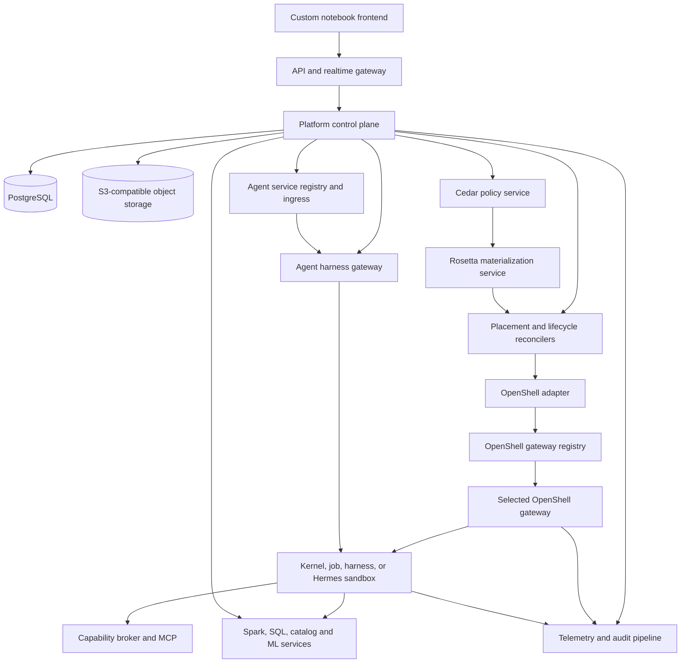
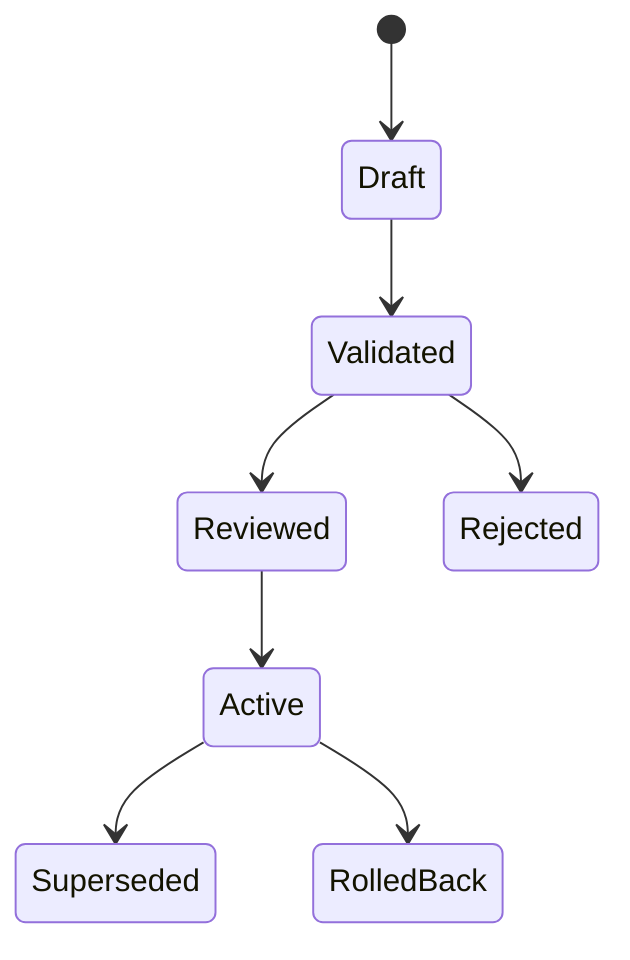
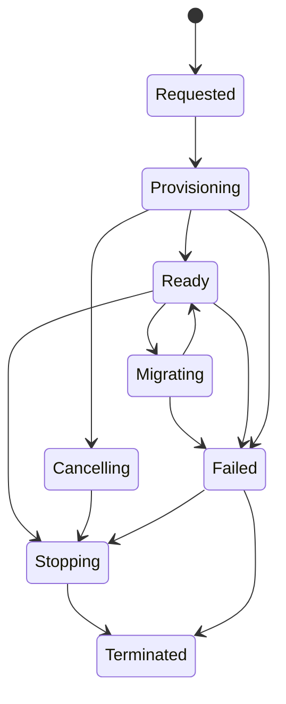
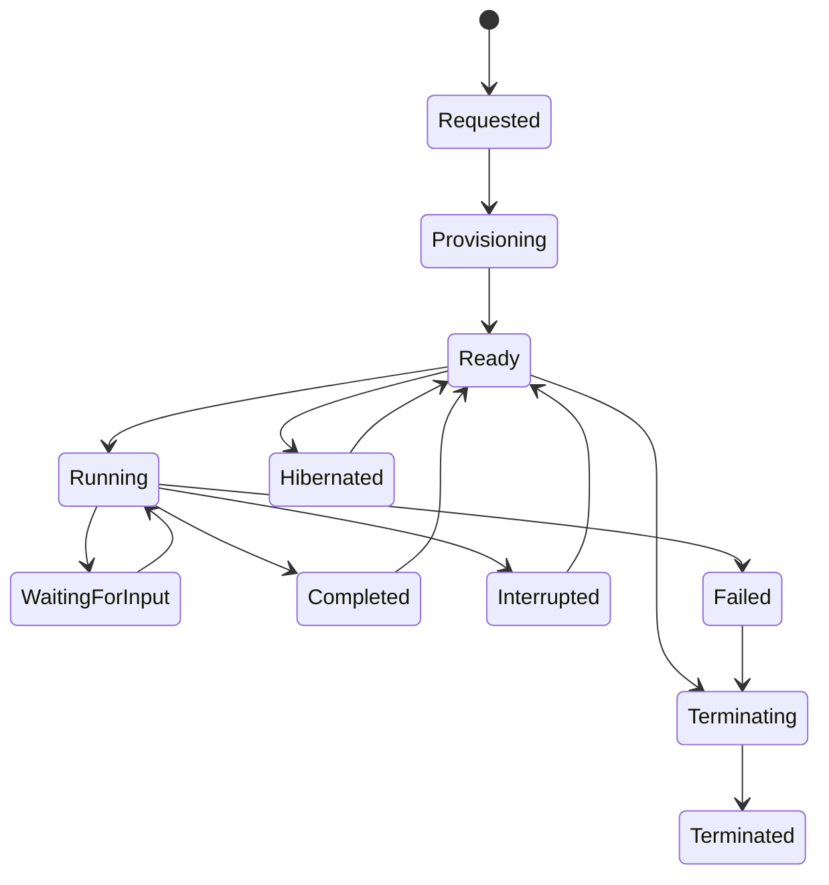
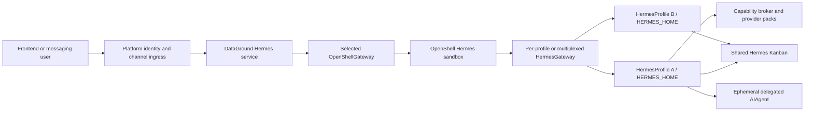

# DataGround

## Internal Engineering System Specification

**Status:** Draft 0.4.1 — implementation-starter sequencing amendment complete
**Date:** 2026-07-15
**Audience:** Engineering, platform operations, security, and product engineering
**Purpose:** Build specification

## 1. Executive summary

This document specifies DataGround: a self-hosted-first, open-source-first data engineering, notebook, and agent-execution platform. The existing custom notebook frontend is the primary user interface. NVIDIA OpenShell is the sandbox execution substrate for interactive notebook kernels, jobs, coding-agent harnesses, and Hermes deployments. Production targets self-hosted Kubernetes; conforming cloud Kubernetes remains supported behind replaceable interfaces; local development supports both Docker/Podman and local Kubernetes.

OpenShell does not replace the product control plane or the application semantics of an agent harness. It provides sandbox lifecycle, runtime isolation, filesystem and process controls, network policy, credential mediation, inference routing, and security logging. Cedar is the authoritative authorization language. Rosetta is the external Cedar-to-OpenShell materialization service; a v1 contract candidate exists, while its tagged and conformance-certified production release remains the only unresolved implementation-freeze dependency. Native southbound adapters integrate Claude Agent SDK, Codex app-server/SDK, OpenCode server/SDK, and Hermes without making an upstream protocol public. Hermes profiles retain their native independent `HERMES_HOME`, memory, session, skill, schedule, and gateway-state boundaries while OpenShell supplies the actual security boundary. DataGround is multi-tenant by construction but does not force every installation or user to model itself as a tenant: an installation may expose organization/tenant, team, and workspace boundaries according to its configured isolation profile.

The [DataGround architecture decision register](decision-register.md) is normative for decisions and supersedes conflicting proposal or pending language retained in earlier drafts. This specification integrates those decisions into the product and implementation contracts. Exact upstream versions, digests, schemas, provider profiles, and tested capacity values belong in signed release certification manifests rather than permanent architecture prose.

The initial platform shall support:

- browser-based creation and editing of Jupyter notebooks;
- isolated Python kernel sessions launched through OpenShell;
- reproducible runtime environments;
- secure access to object storage, Git repositories, package registries, SQL engines, and inference endpoints;
- interactive SQL and distributed data processing;
- scheduled and API-triggered notebook jobs;
- an Iceberg-based lakehouse with an open catalog contract;
- experiment tracking and artifact management;
- API-driven coding-agent sessions using Claude Code, Codex, or OpenCode;
- streamed agent events, approvals, clarifying questions, structured results, patches, artifacts, cancellation, and resume;
- one or more independent Hermes profiles per eligible OpenShell sandbox, with profile-scoped memory and skills, durable Kanban collaboration, scheduled automation, messaging gateways, media capabilities, and ephemeral delegated sub-agents;
- event-rich interactive service sessions that expose progress, tools, processes, artifacts, approvals, questions, media, notifications, background work, and lifecycle—not only chat messages;
- a platform-native API for synchronous and asynchronous agent-service invocation, event replay, callbacks, cancellation, outputs, and artifacts;
- a platform-native service API; a bounded OpenAI-compatible facade is a later compatibility layer and is not an initial-release dependency;
- one or many registered OpenShell gateways selected by DataGround placement policy;
- installation on a single workstation, a shared self-hosted Kubernetes cluster, or conforming hybrid/cloud Kubernetes without changing product contracts.

OpenShell shall sit behind an internal execution-provider interface and shall not define the platform's public API or persistence model. This remains required even as upstream maturity changes: NVIDIA documents the gateway as the OpenShell control plane and the supervisor as the sandbox-local enforcement boundary, while DataGround owns product identity, tenancy, authorization intent, durable product state, and lifecycle reconciliation. See [OpenShell overview](https://docs.nvidia.com/openshell/about/overview), [How OpenShell works](https://docs.nvidia.com/openshell/about/how-it-works), and the [OpenShell repository](https://github.com/NVIDIA/OpenShell).

## 2. Goals and non-goals

### 2.1 Goals

1. Provide an internal notebook and data platform that can be installed without a mandatory external SaaS dependency.
2. Prefer OSI-approved or otherwise source-available open-source components; record exceptions and license implications.
3. Make the custom notebook frontend independent of the underlying sandbox provider.
4. Treat arbitrary notebook and job code as untrusted.
5. Enforce least-privilege access to files, networks, credentials, compute, and data.
6. Support both local development and production Kubernetes deployments with the same application-level contracts.
7. Use open protocols and formats: Jupyter messaging, OAuth 2.0/OIDC, OpenAPI, OpenTelemetry, S3-compatible object APIs, Apache Iceberg, and Spark Connect.
8. Preserve open interchange and future import/export paths without making dedicated Databricks migration an initial product concern.
9. Express human, service, data, and execution authorization in Cedar without requiring users to write OpenShell YAML directly.
10. Offer one stable agent-harness API while preserving provider-specific capabilities through versioned extensions.
11. Support a persistent Hermes experience without allowing Hermes-native backends, plugins, learned skills, or messaging adapters to bypass platform policy.
12. Publish approved sandbox configurations as multi-user services without exposing raw OpenShell or upstream harness endpoints.
13. Let existing OpenAI SDK clients invoke headless-safe agent services while clearly preserving the distinction between a model response and a full interactive agent session.
14. Make organization/tenant boundaries first-class while allowing trusted installations to operate directly with team-isolated workspaces.
15. Route every sandbox through an explicitly selected OpenShell gateway and preserve gateway identity through lifecycle, audit, and migration.

### 2.2 Non-goals for the first release

- Full compatibility with Databricks REST APIs or proprietary notebook formats.
- A clone of Unity Catalog, Delta Live Tables, Databricks SQL, or Databricks model serving.
- Cross-region active-active operation.
- Arbitrary user-provided container images without admission checks.
- Collaborative real-time notebook editing unless already implemented by the frontend.
- Multi-cloud federation in the first production deployment.
- Claiming that OpenShell alone provides complete multi-tenant isolation for distributed Spark executors.
- Bit-for-bit compatibility with every upstream CLI or private protocol.
- Direct browser access to Claude Code, Codex app-server, OpenCode server, or the Hermes gateway.
- Allowing agent-local permission modes such as “bypass,” “YOLO,” or unrestricted tool access to override Cedar or OpenShell.
- Exposing OpenShell service URLs, sandbox ports, upstream harness servers, or Hermes gateway listeners as the product endpoint.
- Claiming complete OpenAI API parity; the first release implements a declared, conformance-tested subset and rejects unsupported fields.
- Implementing OpenAI Realtime audio/WebRTC compatibility in the first service release. Interactive platform WebSocket events are a separate contract.
- A mandatory general-purpose workflow engine. Initial lifecycle orchestration uses bounded PostgreSQL-backed resource state machines and reconcilers.
- Dedicated Databricks migration tooling until concrete demand and representative migration inputs justify it.

## 3. Design principles

- **Stable product boundary:** clients use platform APIs, never the OpenShell CLI or gateway directly.
- **Default deny:** a session receives no network, filesystem, credential, or data access unless granted by Cedar policy and representable in the target enforcement layer.
- **Policy as source:** Cedar policy and schema versions are the source of authorization intent; generated OpenShell policy is an immutable deployment artifact.
- **Identity propagation:** every request, session, job, query, and data operation is attributable to a human or service principal.
- **Ephemeral placement, declared durable state:** ordinary sandbox-local scratch is disposable; notebooks, datasets, artifacts, Hermes profile exports, checkpoints, logs, and service state survive according to their explicit lifecycle contract.
- **Open interchange:** notebooks remain valid `.ipynb` documents and table data uses an open format.
- **Replaceable infrastructure:** object storage, identity provider, catalog implementation, scheduler, and execution provider are connected through explicit interfaces.
- **No security equivalence by assumption:** OpenShell sandbox controls and Kubernetes workload controls are separate security boundaries and must be tested separately.
- **One control API, multiple harness adapters:** normalize lifecycle, events, approvals, questions, outputs, and usage; keep raw upstream protocols internal.
- **Defense in depth:** harness permissions improve interaction and intent handling; Cedar and OpenShell remain the non-bypassable authorization and enforcement layers.
- **Capability negotiation:** pin every harness version and discover supported features at runtime instead of inferring them from a product name.
- **Native state boundaries:** short-lived coding sessions, Hermes profiles, Hermes Kanban collaboration, and OpenShell sandbox placement have distinct storage, upgrade, recovery, and revocation contracts.
- **Optional tenancy, mandatory scoping:** every resource is scoped, but trusted installations may expose team/workspace boundaries without forcing a tenant concept into ordinary user workflows.
- **Gateway-qualified placement:** `OpenShellGateway` and `HermesGateway` are distinct resources; placement never weakens policy, residency, isolation, or runtime requirements.
- **Publish revisions, not sandboxes:** consumers address an immutable service revision or stable alias; placement, pooling, and sandbox identity remain internal.
- **Event-first interaction:** text is one event type among tools, processes, files, media, approvals, questions, schedules, notifications, usage, and lifecycle.
- **Compatibility without semantic fiction:** OpenAI-compatible endpoints expose only behavior that can be represented faithfully; full agent fidelity remains available through the native API.

## 4. Context and terminology

| Term | Meaning in this specification |
| --- | --- |
| Installation | One DataGround control-plane trust and operations boundary. |
| Organization/tenant | Optional externally meaningful administrative and isolation boundary below an installation. It may be implicit in trusted single-organization deployments. |
| Team | Collaboration and policy scope that may own isolated workspaces without requiring every user to be modeled as a tenant. |
| Workspace | Project/resource boundary containing notebooks, jobs, environments, services, data bindings, and grants; owned within a team or organization/tenant scope. |
| Notebook | Durable Jupyter notebook document owned by a workspace. |
| Session | A time-bounded interactive kernel runtime associated with a notebook and user. |
| Job | A durable definition that executes one or more tasks manually, on a schedule, or through an API. |
| Run | One immutable attempt to execute a job or notebook task. |
| Environment | Immutable OCI image digest plus a versioned manifest containing locks, SBOM, provenance, runtime compatibility, kernels, and policy requirements. |
| Sandbox | An OpenShell-managed execution environment. |
| Compute profile | CPU, memory, GPU, timeout, priority, and scaling policy requested for a session or run. |
| Catalog | Metadata and authorization surface for namespaces, tables, views, and storage locations. |
| Runner adapter | Internal service that translates platform lifecycle operations to OpenShell or another execution provider. |
| Policy bundle | A versioned Cedar schema, policies, templates, entity snapshot rules, tests, and metadata. |
| Enforcement bundle | A run-specific, immutable OpenShell policy plus provenance generated from a Cedar policy bundle. |
| Harness | An agent runtime with its own session, turn, tool, approval, and event semantics, such as Claude Code, Codex, or OpenCode. |
| Harness adapter | A provider-specific process that converts an upstream harness protocol to the platform Agent Harness API. |
| Agent session | A platform-owned conversation and execution lease containing one or more turns against a workspace snapshot. |
| Agent turn | One user instruction and the resulting streamed agent activity, tool calls, questions, and result. |
| Hermes profile | One independent Hermes agent rooted at its own `HERMES_HOME`, with profile-scoped configuration, memory, sessions, skills, schedules, channel identity, and Hermes gateway state. A profile is not a security sandbox. |
| Hermes delegation | Ephemeral child agent with fresh context, restricted tools, its own terminal session, and only the goal/context supplied by its parent. |
| Hermes Kanban | Durable shared task and handoff board used for collaboration among authorized independent Hermes profiles. |
| OpenShellGateway | Registered OpenShell control plane and compute-driver boundary selected for sandbox placement. |
| HermesGateway | One profile-specific or multiplexing Hermes messaging process inside a Hermes sandbox. |
| Capability broker | Platform service that exposes approved tools to agents through MCP or a narrow native adapter while enforcing identity, policy, budgets, and audit. |
| Agent service | A governed, versioned product resource that binds one harness or Hermes template to input/output schemas, data/tool grants, state mode, concurrency, measured usage and safety limits, and one or more ingress surfaces. |
| Service revision | Immutable, deployable snapshot of an agent service, including runtime/image, prompt and skills, policy bundle, schemas, bindings, rollout settings, and compatibility declaration. |
| Service deployment | A routable instance of one service revision with placement, replicas or profile attachment, warm-pool policy, health, rollout, and traffic state. |
| Interaction session | Event-rich, potentially long-lived connection between a principal and a service deployment; supports typed input, steering, interruption, approvals, questions, process state, and replay. |
| Invocation | One synchronous or asynchronous API request to a service, with immutable input, policy context, output, usage, events, and retry lineage. |
| Model alias | OpenAI-compatible model identifier that resolves to one authorized service alias or pinned revision. |

## 5. System architecture



### 5.1 Control plane

The control plane is a set of stateless services backed by PostgreSQL and object storage. It owns all durable product state and exposes versioned APIs.

Required logical modules:

| Module | Responsibilities |
| --- | --- |
| Identity gateway | OIDC login, token validation, service principals, request identity, logout, and session revocation. |
| Scope service | Installation, organization/tenant, team, workspace hierarchy, membership, roles, quotas, isolation profiles, and resource ownership. |
| Notebook service | `.ipynb` validation, revisions, autosave, checkpoints, import/export, and conflict detection. |
| Session service | Session state machine, idempotent lifecycle commands, leases, idle timeout, and frontend attachment. |
| Realtime gateway | Authenticated WebSocket transport for kernel messages, terminal streams, logs, and session events. |
| Environment service | Immutable OCI manifests/digests, dependency locks, kernelspecs, policy requirements, builds, SBOM, signatures, certification, and provenance. |
| Job service | Job definitions, schedules, triggers, parameters, run history, retries, cancellation, and concurrency rules. |
| Lifecycle reconcilers | Bounded PostgreSQL-backed state machines for placement, provisioning, migration, publication, callbacks, jobs, retention, and cleanup. |
| Gateway registry and selector | Registered OpenShell gateways, qualified capabilities, trust/driver/location/capacity metadata, constraints, health, drain, placement reservations, and explainable selection. |
| Cedar policy service | Policy authoring, schema validation, authorization decisions, simulation, versioning, and requests to Rosetta for run-specific OpenShell materialization. |
| Catalog facade | Stable catalog and data-permission API over the chosen Iceberg REST catalog implementation. |
| Artifact service | Presigned object operations, run artifacts, notebook outputs, logs, and retention. |
| Audit service | Append-only security and administrative event stream. |
| Agent harness gateway | Stable API for agent sessions, turns, events, approvals, questions, checkpoints, diffs, usage, cancellation, and resume. |
| Harness registry | Pinned adapter/image versions, upstream schemas, feature flags, compatibility results, and deprecation state. |
| Capability broker | Identity-aware MCP/native tools for Git, web, browser, data, artifacts, messaging, scheduling, media, and delegated execution. |
| Hermes service | Hermes sandbox placement; independent profile homes; profile export/import; Kanban collaboration; per-profile or multiplexed Hermes gateways; memory, skill, schedule, channel, and upgrade governance. |
| Agent service registry | Service definitions, immutable revisions, surface declarations, model aliases, schemas, data/tool bindings, rollout state, and compatibility manifests. |
| Service ingress gateway | REST lifecycle/commands, SSE event streaming/replay, authenticated WebSocket steering implemented last, routing, rate limits, and controller/observer coordination. |
| Callback dispatcher | Durable control-plane webhook subscriptions, signing/authentication, retries, dead letters, replay, delivery inspection, and revocation. |
| OpenAI compatibility gateway | Optional later facade for authorized model discovery and an explicitly bounded, conformance-tested subset. It is not an initial-release dependency. |

Modules may initially run in one deployable service, but their API and data ownership boundaries shall be retained.

### 5.2 Execution plane

Each interactive session, ordinary job run, coding-agent session, or Hermes deployment receives an OpenShell sandbox appropriate to its state and isolation class. A Hermes sandbox may host one or more independent profiles when the selected tenancy/isolation policy permits soft co-location. The sandbox contains:

- the OpenShell supervisor;
- a platform session agent;
- one or more approved Jupyter kernels;
- a Jupyter protocol bridge that connects outbound to the platform realtime gateway;
- platform SDKs and data clients;
- OpenTelemetry instrumentation;
- only opaque provider placeholders, short-lived workload identity, and policy grants required by the workload; no raw provider credential is readable by the harness or notebook process.

Coding-agent sandboxes additionally contain exactly one pinned harness runtime and one platform adapter. Hermes sandboxes contain a pinned Hermes runtime, one or more separately rooted profiles, the selected per-profile or multiplexed Hermes gateway topology, and only approved toolsets/integrations. Profiles remain independent agents with distinct memory, sessions, skills, schedules, and gateway state; ephemeral `delegate_task` children start with fresh context; durable cross-profile work uses Kanban. Service deployments may attach a dedicated sandbox/profile set, allocate from a verified clean pool, or create an isolated sandbox per invocation according to the declared state mode. The platform shall not install all harnesses in one production image merely because a community image includes several CLIs.

OpenShell's supervisor applies consistent sandbox semantics across supported compute drivers. Its documented controls cover filesystem access, process privilege reduction, network proxying, inference interception, credential injection, security logging, and gateway relay behavior. See [How OpenShell works](https://docs.nvidia.com/openshell/about/how-it-works).

For production, at least one registered OpenShell gateway shall use the Kubernetes compute driver. Docker or rootless Podman is supported for local development; local Kubernetes is an equal development mode. MicroVM may be offered as a stronger-isolation profile after operational validation. An installation may register several gateways across drivers, clusters, locations, and trust domains. DataGround selects an eligible gateway for each sandbox and never schedules agent pods around the gateway. Moving a workload between gateways is checkpoint-and-recreate migration, not live reassignment.

### 5.3 Data plane

The baseline data plane is:

| Capability | Selected contract | Initial implementation |
| --- | --- | --- |
| Durable platform and lakehouse objects | S3-compatible API | One certified self-hosted implementation per release; platform and lakehouse classes use separate buckets/credentials/policies and may use different physical backends. |
| Table format | Apache Iceberg | Parquet data files and Iceberg metadata. |
| Catalog | Iceberg REST Catalog API | One certified self-hosted conforming implementation per release; the implementation remains replaceable. |
| Distributed compute | Spark APIs | Apache Spark on Kubernetes. |
| Interactive Spark | Spark Connect | Per-user or pooled Spark Connect servers, subject to isolation tests. |
| Interactive SQL | PostgreSQL wire protocol and HTTP | Trino with Iceberg connector. |
| ML tracking | MLflow REST API | Self-hosted MLflow with PostgreSQL and object storage. |

Iceberg is chosen because it is an open table format shared by Spark, Trino, Flink, and other engines, and it defines a REST catalog API rather than binding clients to a proprietary metastore. See the [Iceberg project](https://iceberg.apache.org/) and [REST Catalog specification](https://iceberg.apache.org/rest-catalog-spec/).

Spark Connect is preferred for interactive distributed work because it decouples notebook clients from the Spark server and is explicitly intended for IDE and notebook embedding. See the [Spark Connect overview](https://spark.apache.org/docs/latest/spark-connect-overview.html). Spark itself supports native scheduling on Kubernetes; see [Running Spark on Kubernetes](https://spark.apache.org/docs/latest/running-on-kubernetes.html).

MLflow supplies self-hosted experiment tracking through a REST tracking server, relational backend, and artifact store. See the [MLflow self-hosting architecture](https://mlflow.org/docs/latest/self-hosting/architecture/overview/).

## 6. Notebook frontend integration

### 6.1 Required frontend contract

The custom frontend shall communicate only with the platform edge APIs:

- HTTPS/JSON for notebook, workspace, environment, session, and job resources;
- authenticated WebSocket for kernel messages and streaming events;
- direct object upload/download only through short-lived, scoped URLs returned by the artifact service.

The frontend shall not receive:

- OpenShell gateway credentials;
- Kubernetes credentials;
- Jupyter kernel connection files or raw ZeroMQ ports;
- object-store root credentials;
- catalog service credentials.

### 6.2 Kernel protocol bridge

The platform shall preserve Jupyter message semantics so standard kernels remain usable. Jupyter defines shell, control, stdin, IOPub, and heartbeat channels over ZeroMQ; the platform bridge shall multiplex the relevant messages over one authenticated WebSocket and preserve message IDs, parent IDs, channel, session, buffers, and ordering. The authoritative protocol is documented in [Jupyter messaging](https://jupyter-client.readthedocs.io/en/stable/messaging.html).

Minimum supported messages:

- `kernel_info_request/reply`;
- `execute_request/reply`;
- `stream`, `display_data`, `update_display_data`, `execute_result`, and `error`;
- `complete_request/reply`;
- `inspect_request/reply`;
- `is_complete_request/reply`;
- `history_request/reply` where supported;
- `input_request/reply` with explicit frontend consent;
- interrupt, restart, shutdown, and heartbeat/liveness semantics.

### 6.3 Notebook save behavior

Notebook durability is independent of sandbox files.

1. The frontend loads a notebook revision from the notebook service.
2. Autosave uses optimistic concurrency with an `If-Match` revision or equivalent version field.
3. Cell outputs are saved according to workspace policy: embedded in the notebook, stored as referenced artifacts, or stripped.
4. A running kernel may create local files under its sandbox working directory, but those files are not durable until uploaded through the artifact/workspace API.
5. Session teardown never becomes the mechanism that saves the notebook.

This avoids depending on OpenShell file transfer as a live shared filesystem.

## 7. Cedar policy architecture

### 7.1 Authority and scope

Cedar is the authoritative policy language for:

- platform API authorization;
- workspace and resource membership;
- notebook, job, environment, artifact, catalog, and administrative actions;
- the capabilities an execution may receive, including filesystem, network, credential, inference, and service access;
- delegation and policy-administration actions.

Cedar provides authorization, not authentication. The identity gateway authenticates the caller through OIDC and supplies a normalized, non-reusable principal ID to the Cedar authorizer. Cedar authorization requests use the principal, action, resource, and context model described in the [Cedar authorization reference](https://docs.cedarpolicy.com/auth/authorization.html).

The platform shall not treat generated OpenShell YAML as editable policy source. It is a compiled artifact tied to one Cedar policy revision and one execution context.

### 7.2 Policy service responsibilities

The Cedar policy service shall provide:

| Capability | Requirement |
| --- | --- |
| Authoring | Store static policies and approved templates with ownership, description, and change reason. |
| Validation | Parse and validate all policies against a versioned Cedar schema before activation. |
| Authorization | Evaluate platform requests and return allow/deny plus safe diagnostics and decision provenance. |
| Compilation | Materialize execution capabilities and generate an OpenShell-compatible policy. |
| Simulation | Evaluate proposed policy changes against saved and generated test cases before activation. |
| Explanation | Expose matched policy IDs and failed requirements to authorized operators without leaking sensitive entity data. |
| Versioning | Publish immutable policy-bundle versions and support controlled rollback. |
| Audit | Record author, reviewer, source version, schema version, compilation result, activation, and every privileged policy change. |

Cedar schema validation is a separate operation from authorization and must occur when policies are created or loaded. The service shall follow this separation and reject activation on any validation error. See [Cedar policy validation](https://docs.cedarpolicy.com/policies/validation.html) and the [Cedar schema overview](https://docs.cedarpolicy.com/schema/schema.html).

### 7.3 Entity and action model

Initial principal entity types:

- `User`;
- `ServicePrincipal`;
- `PlatformService`;
- `Workload`.

Initial resource entity types:

- `Installation`, `Organization`, `Team`, `Workspace`, `IsolationProfile`, `Notebook`, `NotebookRevision`;
- `Environment`, `ComputeProfile`, `Session`, `Job`, `Run`;
- `Artifact`, `SecretRef`, `CatalogNamespace`, `CatalogTable`, `StorageLocation`;
- `NetworkDestination`, `FilesystemPath`, `InferenceProvider`, `ExternalService`;
- `PolicyBundle` and `PolicyTemplate`.

Representative action groups:

```text
workspace: view, manageMembers, managePolicy
scope: view, manageMembers, manageIsolation, manageQuota
notebook: read, edit, execute, export
session: create, attach, interrupt, restart, terminate
job: create, edit, trigger, operate, delete
data: discover, read, write, administer
artifact: read, write, delete
execution: useNetwork, useFilesystem, useCredential, useInference, exposeService
policy: author, validate, simulate, approve, activate, rollback
```

Entity IDs shall be globally unique and never reused. Every resource carries its installation and effective isolation-domain identifier; organization/tenant, team, and workspace ancestry is represented explicitly even when the UI hides an implicit organization. Friendly names are attributes, not identity keys. Authorization caches, queues, storage prefixes, event partitions, and audit correlation include the effective isolation-domain identifier so equal friendly names cannot collide across domains. This follows Cedar's production guidance for entity identifiers in [Cedar entities](https://docs.cedarpolicy.com/policies/syntax-entity.html).

### 7.4 Cedar-to-OpenShell compilation

The translation service shall compile an effective execution policy for a concrete tuple:

```text
(principal, execution action, installation, organization/tenant, team, workspace,
 isolation profile, notebook/job/service revision, environment, compute profile,
 gateway/runtime target, requested capabilities, policy-escalation mode, runtime context)
```

Compilation is a materialization process, not a general source-to-source translation of arbitrary Cedar syntax.

1. Validate the Cedar schema, policy bundle, entity snapshot, and request.
2. Enumerate requested runtime capabilities from the environment and workload definition.
3. Ask Cedar whether the principal may attach each capability to the execution.
4. Remove every capability that is denied, undecidable, erroneous, unsupported, or not explicitly permitted.
5. Convert the remaining bounded capabilities to OpenShell filesystem, network, process, inference, and provider rules.
6. Validate the generated document against the pinned OpenShell policy schema.
7. Canonicalize and hash the output.
8. Store the source policy version, schema version, entity snapshot reference, compiler version, OpenShell target version, decisions, generated policy, and hash.
9. Return an immutable enforcement-bundle reference to the execution orchestrator.

The compiler shall never broaden a Cedar grant to make it expressible in OpenShell. If an exact or demonstrably narrower mapping is unavailable, compilation fails closed with a stable `POLICY_UNREPRESENTABLE` error.

Rosetta is the separately deployed materialization service for steps 5–7. Calls use workload identity and mTLS. The versioned response records a decision for every requested capability together with source/target hashes, compiler build identity, schema versions, diagnostics, and reproducibility metadata. Wider, ambiguous, malformed, unavailable, timed-out, or version-incompatible results fail closed; DataGround never substitutes a handwritten permissive policy. Rosetta returns no resolved secrets. A v1 contract candidate is available from [asabla/rosetta](https://github.com/asabla/rosetta), but production integration remains blocked until a tagged release, authenticated transport profile, stable error taxonomy, compatibility policy, and conformance fixtures are certified.

### 7.5 Capability mapping

| Cedar capability resource/action | OpenShell target | Compilation rule |
| --- | --- | --- |
| `FilesystemPath` + `execution::readFilesystem` | `filesystem_policy.read_only` | Emit normalized absolute paths only; reject traversal, symlink ambiguity, and host paths. |
| `FilesystemPath` + `execution::writeFilesystem` | `filesystem_policy.read_write` | Emit only approved sandbox paths; write implies read only where OpenShell semantics require it. |
| `NetworkDestination` + `execution::connectReadOnly` | `network_policies` | Emit host, port, protocol, binary, and read-only L7 rules where supported. |
| `NetworkDestination` + `execution::connectReadWrite` | `network_policies` | Emit the narrowest supported methods/paths; never replace with unrestricted host access. |
| `SecretRef` + `execution::useCredential` | provider attachment/token grant | Bind an opaque provider reference; do not place the resolved secret in generated policy. |
| `InferenceProvider` + `execution::useInference` | inference routing policy | Bind approved endpoint/model constraints and provider identity. |
| `ExternalService` + `execution::exposeService` | service exposure policy and platform route | Permit only declared port, protocol, audience, and lifetime. |
| `ComputeProfile` + `execution::useCompute` | sandbox creation parameters | Enforce CPU, memory, GPU, PID, disk, priority, and duration maximums outside user-controlled input. |

Kubernetes network policies, namespace rules, Spark workload policies, and object-store grants may be derived from the same Cedar decision set, but they are separate compiler targets with separate schemas and conformance tests.

### 7.6 Decision semantics and failure behavior

- Absence of an applicable permit produces denial.
- An applicable forbid overrides permits.
- Validation, evaluation, entity-loading, translation, or target-schema errors produce denial or prevent execution creation.
- Policies are never activated without schema validation and tests.
- The runtime uses the exact stored enforcement bundle hash approved during creation.
- Policy updates do not silently mutate a running sandbox. The service marks affected executions and applies one declared strategy: no change until restart, safe live update, or forced termination.
- Emergency forbids may terminate affected sessions and runs after an explicit impact query and audited approval.

Cedar's `forbid` statements do not grant access by themselves; a separate permit remains necessary. The language behavior is described in [Basic Cedar syntax](https://docs.cedarpolicy.com/policies/syntax-policy.html).

### 7.7 Policy lifecycle and change control



Production activation requires:

- successful schema validation;
- compiler success for all declared target versions;
- unit and scenario tests;
- a diff of effective permissions, not only source text;
- review by a separate authorized principal for privileged or organization-wide policy;
- an activation record and rollback target.

Policy templates shall be used for repeated grants rather than constructing Cedar text through string concatenation. Cedar's security guidance recommends templates and warns against dynamic string concatenation; see [Cedar security guidance](https://docs.cedarpolicy.com/other/security.html).

Policy administration uses one of three maintained separation profiles:

| Profile | Activation model |
| --- | --- |
| Owner-managed | One explicitly authorized administrator may author and activate; intended for local or small trusted installations. |
| Reviewed | Production default: an author proposes and a different authorized reviewer activates. |
| High-assurance | Platform security owns the mandatory baseline; organization/tenant authors propose scoped overlays; independent reviewers activate; workspace administrators bind only approved templates and parameters. |

A parent scope may require a stricter minimum and a child cannot weaken it. Emergency revocation is a narrowly held, audited role that narrows access or terminates/re-evaluates affected executions; it cannot author broader grants. DataGround ships Development, Standard Production, and High-assurance Multi-tenant policy templates with example roles, tests, rollback, and operating guidance.

### 7.8 Runtime policy-escalation and headless action rules

The Cedar-governed effective mode is inherited from installation, organization/tenant, workspace, service revision, principal, and invocation policy:

| Mode | Behavior |
| --- | --- |
| Locked | Sandbox-originated widening proposals are disabled; a new approved revision or operator redeployment is required. |
| Semi-interactive | Default. A narrowly normalized dynamic network proposal may wait for an authorized human or external approval workflow; Cedar and the OpenShell prover must both accept it. |
| Auto | A proposal may be approved without a human only inside explicit global and revision Cedar ceilings and only when OpenShell reports an empty prover delta. |

The sandbox, harness, model, tool, or service owner cannot weaken the mode at runtime. Static filesystem, process, identity, mount, or compute changes require a new execution. Approved dynamic grants carry provenance, expiry, and revocation; narrowing and emergency revocation always take precedence.

Headless actions require both a Cedar grant and exact enforcement. Read/inspect operations may be preapproved when their data, path, destination, tool, and credential scopes are enforceable. Reversible or idempotent mutations additionally require an immutable service-revision grant, bounded target, idempotency protection, and compensation/retry semantics. Irreversible, high-impact, privilege-changing, ambiguous, audit-only, or otherwise unrepresentable mutations are denied headlessly and require a separate approved workflow or interactive authorization. OpenShell Policy Advisor proposals are untrusted inputs, not business authorization.

### 7.9 Translation verification

The policy service shall maintain a differential test harness:

1. generate representative principal/action/resource/context requests;
2. evaluate them with Cedar;
3. compile allowed runtime capabilities;
4. exercise the generated policy in a real OpenShell sandbox;
5. assert that every denied action remains denied and every promised supported action succeeds;
6. repeat against every supported OpenShell version and compute driver.

For security, “Cedar allows but target denies” is a compatibility defect; “Cedar denies but target allows” is a release-blocking isolation defect.

## 8. OpenShell integration

### 8.1 Adapter boundary

The execution orchestrator shall call a `RunnerProvider` interface. OpenShell is the first provider.

```text
CreateExecution(spec, idempotency_key) -> execution_id
GetExecution(execution_id) -> state, reason, endpoints
ExecuteCommand(execution_id, command_spec) -> operation_id
StreamEvents(execution_id, cursor) -> event stream
UpdatePolicy(execution_id, policy_revision) -> applied_revision
UploadArtifact(execution_id, source) -> result
DownloadArtifact(execution_id, path) -> artifact reference
TerminateExecution(execution_id, grace_period) -> operation_id
```

The adapter shall use an OpenShell API or supported SDK, not shell out to a human-oriented CLI in production. If the required upstream API surface is unstable, the adapter shall isolate version-specific code and run contract tests against the pinned OpenShell release.

### 8.2 Sandbox creation specification

Every creation request shall include:

- immutable platform execution ID and labels;
- approved sandbox image digest, not a mutable tag;
- CPU, memory, optional GPU, PID, disk, and duration limits;
- non-root UID/GID;
- Cedar policy-bundle revision and immutable compiled enforcement-bundle reference;
- provider attachments or dynamic grants that expose only opaque placeholders/identity to the workload and keep resolved provider secrets at the OpenShell or broker boundary;
- environment variables that contain no durable secret values;
- the session-agent bootstrap command;
- idle and absolute lifetime;
- telemetry correlation identifiers.

The platform state machine is:



All transitions shall be reconciled. Desired and observed state, generation, state-machine version, operation ID, attempt, lease owner/expiry, next reconciliation time, error classification, and terminal result are durable. A control-plane restart must not orphan executions, and repeated create, cancel, migrate, or terminate requests must be idempotent. Lost acknowledgements trigger provider observation before an external side effect is repeated.

### 8.3 Policy application

OpenShell policy is generated by the Cedar policy service from four inputs:

1. a centrally maintained baseline;
2. the selected environment template;
3. workspace grants expressed as Cedar policies and entities;
4. short-lived run-specific grants.

The effective Cedar decision set and compiled OpenShell policy shall be stored with the run record, hashed, and auditable. User notebook code cannot mutate either artifact.

Required defaults:

- filesystem paths not declared readable or writable are inaccessible;
- the workspace and temporary paths are writable; system/runtime paths are read-only;
- outbound networking is denied unless an allow rule identifies destination, protocol, access mode, and permitted binary;
- privileged execution, host mounts, host networking, and unrestricted Kubernetes API access are prohibited;
- provider access is mediated through OpenShell placeholders, inference routing, request-time proxying, or a credential-holding bridge; resolved provider secrets are never readable by the kernel or written into notebook content;
- inference traffic uses configured routing and policy rather than arbitrary direct endpoints where feasible.

OpenShell documents default-deny filesystem behavior in its [policy schema](https://docs.nvidia.com/openshell/reference/policy-schema) and network, filesystem, process, and inference controls in its [security guidance](https://docs.nvidia.com/openshell/security/best-practices).

### 8.4 Service routing

The platform shall normally use an outbound connection from the sandbox session agent to the realtime gateway. This avoids exposing a per-kernel inbound service.

OpenShell service exposure or port forwarding may be used for development diagnostics, but generated service URLs are not product API contracts. OpenShell documents gateway-mediated service exposure and sandbox connections in [Manage Sandboxes](https://docs.nvidia.com/openshell/sandboxes/manage-sandboxes).

### 8.5 Authentication to OpenShell

Production OpenShell gateways shall require authenticated access. Kubernetes deployments shall use OIDC or a trusted reverse-proxy identity model, TLS in transit, and authenticated sandbox supervisors. Unauthenticated gateway access is prohibited in shared environments. OpenShell's Kubernetes access-control documentation supports OIDC bearer-token validation, while its gateway configuration calls unauthenticated user access an unsafe local-development/trusted-proxy escape hatch. See [Kubernetes access control](https://docs.nvidia.com/openshell/kubernetes/access-control) and [gateway authentication](https://docs.nvidia.com/openshell/reference/gateway-auth).

Only the execution orchestrator may call user-facing OpenShell lifecycle APIs. End users interact through the platform authorization layer.

### 8.6 Gateway registry and placement

Each registered `OpenShellGateway` has immutable identity and versioned metadata for endpoint/trust domain, compute driver, cluster or host, region/failure domain, installation and tenancy scope, isolation level, architectures/accelerators, runtime and policy-schema compatibility, provider availability, network/data locality, capacity, health, drain, and certification state.

For each sandbox, DataGround resolves the revision, runtime matrix, environment, isolation and residency rules, organization/tenant and team policy, provider, accelerator, network, and availability requirements. It hard-filters gateways that cannot meet every constraint, ranks eligible gateways by health/capacity/locality/failure-domain/maintenance policy, acquires an idempotent placement reservation, and asks the selected gateway to provision through its configured driver. The execution record binds gateway identity, sandbox identity, driver, runtime matrix, and policy hash. No eligible gateway produces an explainable queue or admission failure; constraints are never weakened silently.

Gateway placement is immutable for a running sandbox. A drained gateway receives no new placements. Gateway loss does not allow another gateway to adopt the old sandbox; recoverable work is restored or resubmitted through checkpoint-and-recreate migration. Local Docker/Podman and local Kubernetes register a gateway and exercise this same contract.

## 9. Agent harness and Hermes sandbox architecture

### 9.1 Scope and upstream basis

The platform shall add two related but distinct execution products:

1. **Coding harness sessions:** API-driven, workspace-bound Claude Code, Codex, and OpenCode sessions with a normalized lifecycle and event model.
2. **Hermes profiles:** long-lived personal or workspace assistants with persistent memory, skills, schedules, messaging routes, media, integrations, and delegated execution.

OpenShell already documents Claude Code, OpenCode, and Codex in its base image, and Hermes as a NemoClaw blueprint-managed agent. Coverage differs: the current OpenShell support table describes full default-policy coverage for Claude Code, partial coverage for OpenCode, no default coverage for Codex, and blueprint-managed support for Hermes. The platform therefore owns a tested policy overlay and pinned image for every profile rather than assuming the base image is production-ready. See [OpenShell supported agents](https://docs.nvidia.com/openshell/about/supported-agents).

### 9.2 Sandbox profiles

| Profile | Lifetime | Runtime | Durable state | Primary interface |
| --- | --- | --- | --- | --- |
| `harness-claude-code` | Turn or multi-turn lease | Claude Agent SDK and Claude Code runtime | Platform transcript, workspace revisions, optional upstream resume token | Agent Harness API |
| `harness-codex` | Turn or multi-turn lease | Codex app-server and pinned SDK/CLI | Platform transcript, thread reference, workspace revisions | Agent Harness API |
| `harness-opencode` | Turn or multi-turn lease | OpenCode server and SDK | Platform transcript, session reference, workspace revisions | Agent Harness API |
| `hermes-profile` | Long-running or hibernatable | Hermes Agent gateway/profile runtime | Encrypted profile volume or state bundle | Hermes Profile API and approved messaging routes |
| `agent-batch` | One run | Selected harness in non-interactive mode | Final result, events, usage, patch, and artifacts | Job API |

Every profile shall use a separate image manifest, binary allowlist, Cedar capability template, OpenShell policy fixture, contract suite, SBOM, and release channel. Image manifests pin the OpenShell supervisor, harness runtime, adapter, language runtime, system packages, and default tools by digest or immutable version.

### 9.3 Agent Harness API

The public API is platform-owned and provider-neutral. It exposes common semantics and an optional versioned provider-extension object; it never proxies an upstream protocol directly.

Southbound integration uses one native adapter per initially supported harness because Claude Agent SDK, Codex app-server/SDK, and OpenCode server/SDK expose materially different lifecycle, approval, event, and state semantics. The [Agent Client Protocol](https://agentclientprotocol.com/get-started/introduction) is monitored as a possible later facade, but is not the internal canonical contract until the required harnesses implement and preserve the DataGround capability set. This avoids maintaining both native and ACP paths as equal sources of truth.

Minimum resources:

```text
GET    /api/v1/harnesses
GET    /api/v1/harnesses/{harness}/capabilities
POST   /api/v1/agent-sessions
GET    /api/v1/agent-sessions/{session_id}
DELETE /api/v1/agent-sessions/{session_id}
POST   /api/v1/agent-sessions/{session_id}/turns
GET    /api/v1/agent-sessions/{session_id}/turns/{turn_id}
GET    /api/v1/agent-sessions/{session_id}/events
POST   /api/v1/agent-sessions/{session_id}/interrupt
POST   /api/v1/agent-sessions/{session_id}/resume
POST   /api/v1/agent-sessions/{session_id}/approvals/{approval_id}
POST   /api/v1/agent-sessions/{session_id}/questions/{question_id}/answers
GET    /api/v1/agent-sessions/{session_id}/changes
POST   /api/v1/agent-sessions/{session_id}/checkpoints
POST   /api/v1/agent-sessions/{session_id}/rollback
GET    /api/v1/agent-sessions/{session_id}/artifacts
GET    /api/v1/agent-sessions/{session_id}/usage
```

Create-session request:

```json
{
  "workspace_id": "ws_123",
  "harness": "codex",
  "source": { "kind": "git", "repository_ref": "repo_9", "revision": "sha256..." },
  "environment_id": "env_agent_base_v3",
  "compute_profile": "agent-medium",
  "mode": "interactive",
  "capabilities": ["workspace.read", "workspace.write", "git.diff", "test.run"],
  "approval_policy": "interactive",
  "output_schema": null,
  "limits": { "turn_seconds": 1800, "session_seconds": 14400, "max_cost_units": 100 }
}
```

The response returns platform IDs, negotiated capabilities, session state, expiry, an event cursor, and a short-lived realtime grant. It does not return raw upstream credentials, OpenShell IDs, or upstream listening endpoints.

All create, turn, approval, resume, checkpoint, and interrupt operations accept an idempotency key. Concurrent turns in one session are rejected unless the selected harness explicitly supports them and the workspace model provides isolated branches or worktrees.

### 9.4 Session and turn lifecycle



- A **platform session** may contain multiple upstream sessions after an adapter restart, but the mapping is explicit and audited.
- A **turn** has one terminal status: `completed`, `interrupted`, `timed_out`, `budget_exceeded`, `denied`, `failed`, or `lost`.
- `WaitingForInput` covers a tool approval or clarifying question and has an expiry. Expiry denies the action by default.
- A lease heartbeat protects active sessions. Missing heartbeats trigger reconciliation before termination.
- Resume requires the same workspace identity, compatible image and adapter versions, and an available upstream resume primitive. Otherwise the platform reconstructs context from its canonical transcript and marks the resume as `replayed` rather than `native`.

### 9.5 Normalized event stream

Events are delivered over authenticated Server-Sent Events for simple clients and WebSocket where bidirectional steering is required. Each event has `event_id`, monotonically increasing `sequence`, `occurred_at`, `session_id`, `turn_id`, `attempt`, `type`, `source`, and redacted `payload`. Clients resume with `Last-Event-ID` or an explicit cursor.

Core event types:

```text
session.provisioning       session.ready             session.hibernated
turn.started               turn.steered              turn.completed
turn.interrupted           turn.failed               turn.usage
assistant.delta            assistant.message         reasoning.summary
tool.requested              tool.started              tool.progress
tool.completed              tool.denied               tool.failed
approval.required           approval.resolved         approval.expired
question.required           question.answered         question.expired
command.started             command.output            command.completed
file.changed                patch.ready               checkpoint.created
artifact.created            upstream.retry            warning
```

Provider-specific events may appear only under `extension.<harness>.<name>` with a versioned schema. Unknown extensions are ignorable. Raw upstream event capture is disabled by default, encrypted when enabled for diagnostics, access-controlled, and retention-limited because it may contain secrets or unredacted model context.

The gateway applies bounded queues and backpressure. Large command output, diffs, images, and structured results are stored as artifacts; events carry bounded previews and references. Slow clients do not block the harness process.

### 9.6 Approvals, questions, and policy composition

Agent-local permissions are a user-interaction mechanism, not the security boundary.

1. Cedar decides whether the principal may request a capability for the session.
2. The Cedar compiler emits the outer OpenShell enforcement bundle.
3. The adapter configures the harness with an equal or narrower tool/permission set.
4. A dynamic tool request is normalized and checked again against Cedar and the active execution policy.
5. If the action requires human approval, the platform emits `approval.required` and pauses the turn.
6. The user may `allow_once`, `allow_for_session`, `deny`, or `allow_modified` when the adapter can safely rewrite inputs.
7. Approval never expands OpenShell policy. A request outside the compiled bundle is denied without prompting.

Approval records contain the requester, normalized action, target, bounded input preview, risk classification, deciding principal, decision, reason, expiry, and policy versions. Secret values and full file contents are excluded.

Clarifying questions use a separate `question.required` resource. The schema supports one or more questions, 2–4 labelled options, multi-select, free-text when enabled, and provider previews stored as untrusted display content. HTML previews are sanitized before rendering.

Bypass modes such as Claude Code `bypassPermissions`, Codex `danger-full-access`, OpenCode broad allow rules, and Hermes `--yolo` are disabled in shared profiles. They may be enabled only by a Cedar-authorized, explicitly named disposable profile whose OpenShell policy is still restrictive and whose workspace contains no durable secrets.

### 9.7 Workspace, source, changes, and artifacts

- The control plane materializes an immutable source snapshot into `/sandbox/workspace` or `/workspace` according to the image contract.
- Harnesses receive a writable overlay or isolated Git worktree; they do not receive a host bind mount.
- The session records the base revision, working-tree status, submodules, large-file references, and repository identity.
- File writes are captured as an ordered change journal and final binary-capable patch where possible.
- A harness cannot push, open a pull request, publish a package, deploy, or send a message unless that external side effect is a distinct Cedar capability and brokered tool.
- Checkpoints freeze the change journal, declared artifacts, adapter state, and upstream session reference. Rollback is implemented by the platform workspace manager, not trusted solely to the harness.
- On teardown, declared artifacts and changes are exported before scratch storage is destroyed. Export failure moves the session to `termination_blocked` until retention policy or an authorized operator resolves it.
- Repository credentials are short-lived, repository-scoped, and delivered only to a broker or credential-aware proxy. They are not stored in the Git remote URL.

### 9.8 Claude Code adapter

The preferred integration is the Claude Agent SDK in Python or TypeScript, not terminal scraping. Anthropic documents that the SDK exposes the same tools, agent loop, and context management as Claude Code, supports streamed messages, permissions, hooks, sessions, structured output, MCP, skills, plugins, subagents, checkpointing, cost tracking, and OpenTelemetry. See the [Claude Agent SDK overview](https://code.claude.com/docs/en/agent-sdk/overview).

Adapter contract:

- run the SDK in deterministic scripted configuration; use Claude Code `--bare` semantics or equivalent explicit SDK options so user-level hooks, skills, plugins, MCP servers, memory, and `CLAUDE.md` are not discovered accidentally;
- pass only platform-generated settings, tools, MCP configuration, system additions, and agent definitions;
- use API-key or supported cloud-provider authentication; do not embed or redistribute `claude.ai` login/session credentials;
- stream native SDK messages into normalized events;
- map `canUseTool` to platform approvals and `AskUserQuestion` to question resources;
- install a `PreToolUse` hook for checks that must run on every tool call, including calls that upstream rules auto-approve;
- preserve and encrypt the upstream session ID only for native resume;
- use JSON Schema structured output when requested and retain the raw result as an artifact on validation failure;
- feature-detect protocol capabilities from SDK/system messages where available and pin the SDK/runtime pair.

Anthropic's programmatic-mode documentation supports `-p`, `--output-format json|stream-json`, structured output, session resume, explicit tools, and `--bare`; the SDK documentation exposes approval callbacks that can allow, deny, modify, or defer a tool request. See [programmatic Claude Code](https://code.claude.com/docs/en/headless) and [handling approvals and user input](https://code.claude.com/docs/en/agent-sdk/user-input).

### 9.9 Codex adapter

The preferred deep integration is `codex app-server` over stdio JSONL inside the sandbox. The platform adapter owns the process and converts its JSON-RPC-like protocol to the Agent Harness API. App-server is designed for rich clients and exposes authentication, threads, turns, approvals, conversation history, and streamed agent events. For one-shot batch work, the Codex SDK or `codex exec --json --ephemeral` may be used behind the same adapter.

Adapter contract:

- use stdio as the default transport; Unix socket is allowed for a sidecar; never expose the experimental WebSocket listener outside sandbox loopback;
- perform `initialize`/`initialized` once per transport connection;
- map platform sessions to Codex threads and platform turns to Codex turns;
- support thread start, resume, fork, turn start, steer, and interrupt when advertised by the pinned schema;
- generate TypeScript or JSON Schema artifacts from every pinned app-server version and compile the adapter against them;
- normalize item lifecycle, agent-message deltas, command execution, file changes, MCP calls, web searches, plan updates, usage, completion, and errors;
- expose app-server approvals through platform approval resources and keep Codex sandbox/approval settings no broader than the Cedar/OpenShell bundle;
- use `--ignore-user-config` and controlled rules/configuration for deterministic automated profiles;
- use `--output-schema` for structured batch results and capture the last message plus the full JSONL event stream;
- use an ephemeral Codex home unless native session resume is required; authentication material is delivered just in time and excluded from workspace artifacts.

OpenAI documents app-server as the rich-client interface and the SDK/`codex exec` as the automation interfaces. App-server schemas are generated from the installed version, so schema generation is part of adapter release. See the [Codex app-server documentation](https://developers.openai.com/codex/app-server), [Codex SDK](https://developers.openai.com/codex/codex-sdk), and [Codex non-interactive mode](https://developers.openai.com/codex/non-interactive-mode).

### 9.10 OpenCode adapter

The preferred integration is a loopback-only `opencode serve` process with the generated TypeScript SDK. OpenCode exposes an OpenAPI 3.1 document, typed session APIs, permission responses, structured output, and Server-Sent Events. See the [OpenCode server](https://opencode.ai/docs/server/) and [OpenCode SDK](https://opencode.ai/docs/sdk/).

Adapter contract:

- bind the server to `127.0.0.1` inside the sandbox; the platform never forwards its port to the browser;
- use a random per-session server password in addition to the OpenShell boundary, but do not treat HTTP Basic authentication as tenant authorization;
- capture the exact OpenAPI document from `/doc` for every pinned release and generate the adapter client from it;
- map OpenCode projects and sessions to platform workspaces and agent sessions;
- normalize session create/get/update/delete, prompt, command, shell, abort, summarize, revert/unrevert, messages, structured output, and permission responses;
- consume the SSE event stream with cursoring, deduplication, bounded buffering, and adapter heartbeats;
- disable session sharing and remote provider OAuth flows unless explicitly supported by a platform product flow;
- supply provider access through OpenShell-mediated placeholders/routing or a credential-holding broker, and restrict OpenCode configuration, agents, commands, formatters, LSP servers, skills, custom tools, plugins, and MCP servers to the selected environment manifest;
- treat experimental tool endpoints as unsupported unless a harness capability record and contract test explicitly enable them.

### 9.11 Normalized harness capability matrix

`required` means the first production adapter must support the capability. `extension` means it remains provider-specific until a stable cross-harness semantic is defined.

| Capability | Claude Code | Codex | OpenCode | Platform requirement |
| --- | --- | --- | --- | --- |
| Multi-turn session | SDK session | thread | session | Required |
| Streaming | SDK message stream | app-server notifications | SSE | Required |
| Interrupt/cancel | query cancellation | `turn/interrupt` | session abort | Required |
| Resume | session ID | thread resume | existing session | Required with compatibility check |
| Steering while active | streaming input | `turn/steer` | adapter-dependent | Required where advertised; queue fallback |
| Tool approval | `canUseTool` | app-server approval | permission response API | Required |
| Clarifying question | `AskUserQuestion` | normalized user-input event when available | prompt/permission extension | Required with provider fallback |
| Structured result | JSON Schema | output schema | JSON Schema format | Required |
| File change stream | hooks/messages | file-change items | file/session events | Required |
| Checkpoint/rollback | SDK checkpointing | platform workspace checkpoint | revert + platform checkpoint | Platform checkpoint required |
| MCP | supported | supported | supported | Brokered, manifest-defined |
| Skills/instructions | skills, plugins, `CLAUDE.md` | skills, plugins, `AGENTS.md` | skills, agents, rules | Curated environment only |
| Subagents | SDK subagents | collaboration features by version | child sessions/agents | Extension; platform quotas apply |
| Usage/cost | SDK result/usage | turn usage | provider/session metadata | Required |

The harness capability endpoint returns supported API version, adapter version, runtime version, native features, normalized features, limits, known degradations, and schema hashes. Feature negotiation uses this record, not version-string comparison in clients.

### 9.12 Hermes profile architecture

Hermes is not treated as another short-lived coding CLI. It is a persistent agent product with its own gateway, session continuity, memory, skills, cron scheduler, messaging adapters, toolsets, plugins, MCP client, media features, subagents, and multiple terminal backends. Hermes documentation lists tools for web, files and terminal, browser, media, orchestration, memory, scheduling, Home Assistant, and MCP; it also supports many messaging platforms through one gateway. See [Hermes tools and toolsets](https://hermes-agent.nousresearch.com/docs/user-guide/features/tools), [messaging gateway](https://hermes-agent.nousresearch.com/docs/user-guide/messaging), [profiles](https://hermes-agent.nousresearch.com/docs/user-guide/profiles), and the [Hermes repository](https://github.com/NousResearch/hermes-agent).

The reference deployment distinguishes OpenShell placement from Hermes-native profile and gateway boundaries:



The OpenShell documentation identifies Hermes as blueprint-managed through NemoClaw. The implementation shall evaluate the current NemoClaw Hermes blueprint as the starting image and policy, but retain the platform's own profile, identity, Cedar, state, and API contracts. Upstream blueprint management does not replace platform lifecycle ownership.

### 9.13 What the platform exposes to Hermes

| Hermes capability | Exposure mechanism | Platform constraints |
| --- | --- | --- |
| Model inference | OpenShell `inference.local` or authenticated provider proxy | Allowed models, token/cost budgets, rate limits, no durable provider key in profile files |
| Terminal and files | Hermes local backend inside the OpenShell sandbox | No nested host backend; workspace-only paths; Cedar/OpenShell remain authoritative |
| Web search/extraction | Remote HTTP MCP or capability-broker tool | Destination allowlist, response-size limit, provenance, prompt-injection scanning |
| Browser automation | Dedicated remote browser MCP/service | Separate browser identity, egress policy, downloads quarantine, screenshots as artifacts |
| Vision, image generation, TTS, STT | Media broker and object artifacts | MIME/size policy, content handling, scoped provider tokens, retention controls |
| Persistent memory and session search | Native profile-scoped `HERMES_HOME` and configured memory provider | Per-profile isolation, encryption, export/delete, retention, provenance; no synthetic sandbox-wide memory store |
| Skills | Hermes-native skills and `skill_manage`, seeded by profile distributions/DataGround templates | Versioned lineage, scan/evaluation, rollback; activation follows locked, semi-interactive, or auto policy mode and never silently widens capabilities |
| MCP integrations | Broker-generated Hermes MCP configuration | Remote HTTP+mTLS preferred; explicit per-server tool include list; no arbitrary stdio install in production |
| Cron and scheduled automation | Platform scheduler compatibility adapter | Platform job is authoritative; headless approvals deny by default; delivery is explicit |
| Messaging | Platform channel ingress/egress adapters | OIDC/account linking, channel allowlist, rate limits, audit, attachment scanning |
| Delegation/subagents | Hermes-native `delegate_task` inside the sandbox; DataGround service invocation for cross-sandbox work | Fresh child context and restricted tools; instrument usage and enforce operational safety ceilings; durable cross-profile work uses Kanban |
| Home Assistant and external integrations | Curated MCP or broker adapter | Per-tool Cedar actions, scoped identity, explicit mutation approvals |
| Plugins | Signed profile extension bundle | No runtime package install without build pipeline, SBOM, scan, and approval |

Remote HTTP MCP is preferred because Hermes supports local stdio and remote HTTP servers, per-server tool filtering, OAuth, and mTLS. Production profiles shall receive a generated MCP configuration containing only platform endpoints and opaque credential references. Hermes may discover tools, but the broker separately authenticates the workload and authorizes every invocation. See [Hermes MCP integration](https://hermes-agent.nousresearch.com/docs/user-guide/features/mcp).

### 9.14 Hermes profile state and sandbox checkpointing

Hermes itself defines the durable agent boundary: each profile has a separate `HERMES_HOME` containing configuration, `SOUL.md`, memory, sessions, skills, cron jobs, logs, state database, and Hermes gateway state. Profiles are independent agents and do not share memory or sessions. DataGround shall preserve that layout rather than merge profile data into a proprietary sandbox-level memory model. The upstream [profiles documentation](https://hermes-agent.nousresearch.com/docs/user-guide/profiles) is the compatibility reference for this boundary.

The DataGround resource contract is:

```text
CreateHermesSandbox(template_revision, placement_constraints) -> sandbox_id
CreateProfile(sandbox_id, profile_distribution, policy) -> profile_id
ExportProfile(profile_id, selectors) -> immutable_profile_export
ImportProfile(profile_export, target_sandbox_id) -> profile_id
CheckpointSandbox(sandbox_id) -> manifest(profile_exports, kanban_state, gateway_topology)
MigrateSandbox(sandbox_id, target_gateway) -> new_placement | rollback
DeleteProfile(profile_id, retention_mode) -> tombstone
DeleteHermesSandbox(sandbox_id, retention_mode) -> tombstone
```

A sandbox checkpoint is a consistency manifest over exact profile exports, shared Kanban state, Hermes gateway topology, runtime matrix, policy revisions, and restore order. It is not a new memory store. Hibernation or migration quiesces every resident profile gateway and Kanban dispatcher, exports state, restores into a new immutable placement, validates each profile and collaboration surface, switches ingress, retains a bounded rollback checkpoint, and then retires the old placement.

Profile distributions are the native configured-agent distribution mechanism and deliberately exclude authentication and user data. Profile export/import is the backup/restore mechanism. Project checkpoints and `/rollback` protect working-tree changes; they do not replace `HERMES_HOME` backup.

Raw credentials are never stored in profile state. Profile configuration contains opaque provider references/placeholders only; OpenShell mediates resolution at the network/inference boundary. A harness or Hermes process that can read a raw long-lived key is a misconfiguration and fails certification.

### 9.15 Hermes messaging and identity

- External channel webhooks and sockets terminate at a platform messaging edge, not directly at the Hermes sandbox.
- The edge verifies the channel signature/token, scans attachments, applies rate limits, maps the external sender and conversation to platform principals/resources, and calls the profile service.
- Unknown senders are denied. Upstream Hermes pairing may be retained as a user experience, but successful pairing creates a platform identity link and Cedar grant; it is not an independent bypass.
- DM, group, channel, thread, and workspace scopes are distinct resources. Administrator status in one scope does not imply another.
- The platform normalizes message, file, image, audio, thread, reaction, typing, and progressive-update capabilities; adapters degrade explicitly when a channel lacks a feature.
- Egress passes through the platform delivery service so messages, files, and media are policy-checked, rate-limited, attributable, and retryable.
- Silence tokens and channel-specific formatting are resolved at the delivery adapter, while the canonical assistant turn remains stored.

### 9.16 Hermes skills, memory, cron, and delegation governance

**Skills:** DataGround ships maintained templates composed from Hermes profile distributions and prepared skills; users may create, derive, publish, and share their own templates. Hermes may create or improve skills through `skill_manage` and background review. Every change has profile/template provenance, evaluation evidence, capability delta, activation state, and rollback lineage. Locked mode requires approval; semi-interactive mode requests approval when policy requires; auto mode may activate evaluated changes only within existing grants. No skill change silently adds credentials, data scope, destinations, tools, or delegation authority. See [Hermes skills](https://hermes-agent.nousresearch.com/docs/user-guide/features/skills) and [profile distributions](https://hermes-agent.nousresearch.com/docs/user-guide/profile-distributions).

**Memory:** Memory remains profile-scoped according to the configured Hermes memory provider. DataGround governs profile ownership, provider configuration, retention, encryption, export/import, deletion, and audit without assuming one universal record schema for every provider. Users must be able to inspect, correct, export, and delete governed memory through provider capabilities or an explicit declared limitation. Cross-profile durable coordination uses Kanban or governed service calls, not implicit memory search. See [Hermes persistent memory](https://hermes-agent.nousresearch.com/docs/user-guide/features/memory) and [memory providers](https://hermes-agent.nousresearch.com/docs/user-guide/features/memory-providers).

**Cron:** The Hermes `cronjob` experience is implemented through a compatibility tool backed by the platform Job API. This prevents an unobserved second scheduler from becoming authoritative. A schedule freezes the skill/prompt revision, profile, tool grants, delivery target, budget, timezone, and missed-run policy. Dangerous actions cannot wait indefinitely for a human; the default headless decision is deny.

**Delegation:** Hermes `delegate_task` creates ephemeral child `AIAgent` instances with fresh conversation context, restricted toolsets, separate terminal sessions, and only the goal/context supplied by the parent; the final summary returns to the parent. A native delegated child is not a separately provisioned OpenShell sandbox. DataGround records lineage, tools, model/provider, usage, cancellation, and outcomes from the owning Hermes sandbox. Configurable economic/delegation budgets are deferred until representative telemetry establishes the relationship among topology, infrastructure, provider cost, time, and outcome. Operational ceilings, provider quotas, concurrency limits, duration limits, cancellation, and kill controls remain mandatory. See [Hermes subagent delegation](https://hermes-agent.nousresearch.com/docs/user-guide/features/delegation); use [Hermes Kanban](https://hermes-agent.nousresearch.com/docs/user-guide/features/kanban) when work must cross persistent profile boundaries or survive process restarts.

**Nested backends:** Hermes terminal backends for Docker, SSH, Singularity, Modal, and Daytona are disabled by default because they can create execution outside the OpenShell boundary. Equivalent functionality is provided by platform child-sandbox and remote-job tools. Enabling a native backend requires a dedicated Cedar capability, brokered credential, destination-specific network policy, and separate security acceptance.

Hermes documents a defense-in-depth model covering user authorization, command approval, file-write safety, container isolation, MCP credential filtering, context scanning, session isolation, and input sanitization. Those controls remain enabled where compatible, but are treated as inner guardrails beneath Cedar and OpenShell. See [Hermes security](https://hermes-agent.nousresearch.com/docs/user-guide/security).

### 9.17 Harness security requirements

- The adapter and harness run as non-root users with separate writable directories where supported.
- Harness control transports bind to stdio, Unix socket, or loopback only.
- No adapter endpoint is exposed with OpenShell service forwarding in production.
- The harness cannot modify its adapter binary, active policy, credential broker, telemetry sidecar, or runtime manifest.
- Project instruction files (`CLAUDE.md`, `AGENTS.md`, OpenCode rules, Hermes context files) are treated as untrusted repository content and scanned, size-limited, and surfaced in provenance.
- User-, home-, and project-level auto-discovery is disabled unless the environment manifest explicitly includes the source.
- MCP servers, plugins, hooks, skills, formatters, LSP servers, and custom tools are supply-chain dependencies and must be pinned, scanned, allowlisted, and represented in the enforcement bundle.
- Model-provider traffic uses OpenShell inference routing, request-time proxy rewriting, or a credential-holding broker. Direct provider egress is supported only when the approved OpenShell path keeps the resolved provider secret outside the harness process; otherwise the provider mode is unsupported.
- Tool output is untrusted input to the model and frontend. Apply size bounds, content-type validation, terminal-control stripping, URL policy, and HTML sanitization.
- Secret redaction occurs at adapter ingress, event normalization, artifact storage, and UI rendering. Redaction is defense in depth and not a substitute for preventing secret exposure.
- Session sharing, public links, external messaging, Git push, PR creation, package publishing, deployment, and destructive data operations are separate Cedar actions and default to deny.

### 9.18 Reconciliation, upgrades, and compatibility

The harness gateway continuously reconciles platform sessions, OpenShell executions, adapter heartbeats, upstream sessions, workspace leases, approval waits, and profile-state leases.

Upgrade procedure:

1. build a new pinned image and SBOM;
2. capture upstream schemas and capability advertisements;
3. run adapter unit and recorded-event replay tests;
4. run live contract tests in every supported OpenShell compute driver;
5. run policy conformance and escape tests;
6. run session resume and state migration tests;
7. canary on disposable sessions;
8. canary on opt-in persistent profiles with rollback checkpoints;
9. promote the harness registry channel;
10. retain the prior image until all resumable sessions expire or migrate.

Running sessions are never silently moved to a new harness version. Resume across versions is allowed only by a compatibility rule recorded in the harness registry. Persistent Hermes upgrades require a state checkpoint, migration plan, health verification, and automatic rollback on failure.

### 9.19 Operational limits and delegation-economics measurement

The initial release enforces infrastructure and safety limits at installation, organization/tenant, team, workspace, user, sandbox, profile, session, turn, and delegated-child scopes:

- concurrent sessions and persistent profiles;
- CPU, memory, GPU, scratch disk, and profile storage;
- wall time, idle time, tool-call count, and background process age;
- input, output, and cached tokens;
- provider quotas and operator-defined emergency cost ceilings where the provider exposes reliable values;
- network bytes and destination count;
- event rate, command-output bytes, patch size, artifact count/bytes;
- child-agent depth, fan-out, concurrency, and duration safety ceilings;
- messages, attachments, media generation, and channel deliveries;
- schedules and runs per time window.

Limit exhaustion emits a warning threshold where safe, followed by a deterministic terminal event or admission denial. The adapter attempts graceful cancellation, then the lifecycle reconciler terminates the process and eventually the sandbox.

DataGround shall not initially expose a configurable delegation-budget product that claims to optimize cost, tokens, time, or outcomes. It first records tenant-scoped, content-minimized lineage for parent/child topology, models/providers, tokens and reported cost, wall/active/idle and queue time, retries, tool calls, channels, artifacts, CPU/memory/GPU, storage, network, sandbox startup/restore, background work, and outcome. Confidence and attribution gaps are explicit. A later budget ADR must distinguish infrastructure protection, commercial quota, customer cost control, and agent authority.

### 9.20 Harness observability

Required metrics include session provisioning and readiness, active/queued turns, event lag, adapter restarts, approval and question wait time, tool calls by normalized action and result, upstream retries, token/cost use, patch and artifact size, resume success, child-agent fan-out, Hermes memory/skill/cron operations, and messaging delivery outcomes.

Traces connect edge request → Cedar decision → enforcement bundle → OpenShell execution → adapter → upstream turn → tool broker → artifact/delivery. Audit records include capability negotiation, profile changes, skill promotion, memory export/delete, schedule mutation, messaging identity links, approvals, external side effects, and administrative diagnostics.

### 9.21 Functional acceptance criteria for harness sessions

1. One API client can start, prompt, stream, approve, answer, interrupt, resume, inspect changes, and terminate all three coding harnesses without speaking an upstream protocol.
2. The same normalized event schema represents lifecycle, assistant output, tools, commands, file changes, usage, and terminal status for each harness.
3. An unsupported normalized feature is absent from capability negotiation and returns `FEATURE_UNAVAILABLE`, not silent degradation.
4. A denied Cedar capability cannot be enabled by harness settings, prompt instructions, project files, plugins, MCP, or an upstream bypass mode.
5. Approval expiry denies the action and unblocks or terminates the turn deterministically.
6. A disconnected client can resume events without gaps or duplicates and retrieve oversized payloads as artifacts.
7. A base revision plus exported patch reproduces the final workspace state, including binary artifacts through references.
8. Adapter or control-plane restart does not create a duplicate upstream turn.
9. Cost, tokens, tool calls, external side effects, policy versions, runtime versions, and artifact hashes are attributable to the turn.
10. Contract tests pass for the exact pinned harness and OpenShell versions before registry promotion.

### 9.22 Functional acceptance criteria for Hermes profiles

1. A profile can start, receive a frontend message, use an approved tool, persist memory, checkpoint, hibernate, restore, and continue the same conversation.
2. Messaging from an unlinked or Cedar-denied sender never reaches Hermes.
3. Every exposed tool is present in the generated manifest and MCP include list; undisclosed tools are unavailable.
4. A learned skill remains inactive until scan, simulation, and authorized promotion succeed.
5. A scheduled task is represented as a platform job and uses a frozen policy, declared operational ceilings, delivery target, and headless approval mode.
6. Native `delegate_task` children remain inside the owning Hermes sandbox, are visible in profile/runtime telemetry with lineage and restricted toolsets, and cannot exceed that sandbox's Cedar/OpenShell grants; cross-sandbox delegation uses an explicit DataGround service invocation with its own execution record.
7. Hermes never receives direct provider credentials; it cannot use Docker, SSH, Modal, Daytona, Singularity, or arbitrary MCP installation unless the separate capability, destination, brokered identity, and security acceptance are explicitly granted and tested.
8. Profile export and deletion cover transcripts, memory, skills, schedules, artifacts, and state checkpoints according to retention policy; external channel/provider credential bindings are separately revoked and deleted, and raw OAuth/provider tokens are never profile-export content.
9. Profile upgrade failure restores the prior image and state checkpoint.
10. The frontend and supported messaging channels show consistent session status, interruption, tool progress, approvals, and final delivery.

### 9.23 Agent-service exposure model

Notebooks remain the primary surface for exploratory data work, but they are not the universal interface to a sandbox. The platform shall be able to publish a selected harness or Hermes configuration as an **agent service**. Consumers address a service alias or immutable revision; they never address a sandbox, OpenShell service URL, process port, upstream session ID, or harness-native server.

The three product surfaces are complementary:

| Surface | Intended consumers | Transport | Fidelity | Human-in-the-loop |
| --- | --- | --- | --- | --- |
| Interactive event service | Platform frontend, operator console, embedded product UI | Authenticated WebSocket for bidirectional control; SSE plus REST input fallback | Full normalized event and control model | Supported: approvals, questions, steer, queue, interrupt |
| Native Agent Service API | Internal services, workflows, automation, external integrations | REST/OpenAPI, SSE, signed webhooks, optional service-to-service WebSocket | Full resource model, including runs, events, artifacts, callbacks, and typed inputs/outputs | Supported only when caller supplies an approval callback or separate authorized operator |
| OpenAI-compatible model facade | Existing OpenAI SDKs, model gateways, applications expecting a model endpoint | `/v1/models`, `/v1/responses`, optional `/v1/chat/completions`, standard SSE | Deliberately lossy, declared subset | Headless-safe only; an invocation never waits indefinitely for an interactive approval |

All three surfaces resolve to the same service revision, Cedar request context, enforcement bundle, adapter, normalized event journal, output store, usage ledger, and audit lineage. Surface-specific translation must not change the granted capabilities.

OpenShell documents gateway-managed URLs for loopback services inside sandboxes. Those URLs are useful as an internal hop and for diagnostics, but the platform shall place its own authenticated ingress, authorization, routing, schema validation, quotas, and audit boundary in front of them. See [OpenShell long-running service exposure](https://docs.nvidia.com/openshell/sandboxes/manage-sandboxes#expose-long-running-services).

### 9.24 Agent service and deployment resources

Minimum service revision fields:

```yaml
apiVersion: platform.internal/v1
kind: AgentServiceRevision
metadata:
  service_id: svc_research
  revision: 17
spec:
  runtime:
    profile: hermes-profile
    image_digest: sha256:...
    adapter_version: 0.8.1
  source:
    workspace_id: ws_123
    revision: sha256:...
  state:
    mode: sticky-caller
    retention: P30D
  contracts:
    input_schema_ref: schema://research-input/3
    output_schema_ref: schema://research-output/2
  bindings:
    tools: [web.search, catalog.read, artifact.write]
    data: [catalog://analytics/public]
  surfaces:
    interactive: {enabled: true}
    native_api: {enabled: true}
    openai: {enabled: true, chat_completions: true}
  approvals:
    interactive: prompt
    headless: deny
  concurrency:
    max_invocations: 8
    per_session: 1
  budgets:
    max_wall_seconds: 1800
    max_cost_units: 50
```

The revision freezes runtime/image digests, adapter and upstream versions, source or profile template, prompt/instructions, skills/plugins/MCP manifests, Cedar bundle, data/tool bindings, input and output schemas, state mode, approval mode, timeouts, budgets, retention, compatibility matrix, and rollout behavior. Secret values are opaque references and are not part of the revision body.

A service deployment adds environment, traffic state, stable aliases, replicas or profile attachment, minimum/maximum warm capacity, placement, autoscaling, health, and rollout metadata. Its lifecycle is `draft → validating → deploying → ready → degraded → draining → stopped`, with `failed` reachable from validation or runtime states. Traffic reaches only `ready` revisions. Rollback changes alias routing to a prior immutable revision; it never edits a running revision.

Validation shall prove:

- the selected runtime advertises every required normalized capability;
- Cedar grants are representable in OpenShell and every downstream broker;
- schemas compile and compatibility fixtures pass;
- the state and concurrency modes are supported by the runtime;
- headless surfaces cannot enter an unbounded approval or question wait;
- every data, tool, network, secret, media, and delivery binding resolves;
- the requested OpenAI-compatible fields are supported by the declared compatibility profile.

### 9.25 Interactive event service

The interactive surface is an event session, not a chat socket. Text messages are one input and output type among process state, tool activity, files, media, approvals, questions, usage, artifacts, schedules, notifications, and lifecycle changes.

Minimum resources:

```text
POST   /api/v1/service-deployments/{deployment_id}/interaction-sessions
GET    /api/v1/interaction-sessions/{session_id}
DELETE /api/v1/interaction-sessions/{session_id}
GET    /api/v1/interaction-sessions/{session_id}/events
POST   /api/v1/interaction-sessions/{session_id}/inputs
POST   /api/v1/interaction-sessions/{session_id}/interrupt
POST   /api/v1/interaction-sessions/{session_id}/approvals/{approval_id}
POST   /api/v1/interaction-sessions/{session_id}/questions/{question_id}/answers
GET    /api/v1/interaction-sessions/{session_id}/processes
GET    /api/v1/interaction-sessions/{session_id}/artifacts
POST   /api/v1/interaction-sessions/{session_id}/checkpoint
POST   /api/v1/interaction-sessions/{session_id}/hibernate
POST   /api/v1/interaction-sessions/{session_id}/resume
POST   /api/v1/interaction-sessions/{session_id}/connect-token
WS     /api/v1/interaction-sessions/{session_id}/connect
```

The WebSocket protocol uses the normalized envelope from Section 9.5 with sequence numbers, cursors, acknowledgements, bounded payloads, and artifact references. Client messages are typed: `input.message`, `input.command`, `input.file_ref`, `input.audio_ref`, `input.form`, `turn.start`, `turn.steer`, `turn.queue`, `turn.interrupt`, `approval.resolve`, `question.answer`, `events.subscribe`, `events.ack`, `session.checkpoint`, `session.hibernate`, and `session.resume`. Unknown types fail with a protocol error and do not reach the runtime.

The event catalog in Section 9.5 is extended with:

```text
service.ready              service.degraded           session.presence
process.started            process.output             process.status
process.exited             media.created              media.transcribed
notification.requested     notification.delivered     notification.failed
schedule.created           schedule.triggered         schedule.failed
delivery.requested         delivery.completed         delivery.failed
state.checkpointing        state.restored              heartbeat
```

Large logs, binary files, images, audio, patches, and result datasets remain artifacts. An event contains a safe preview, content type, size, checksum, retention, and authorized artifact reference. Terminal control sequences, HTML, Markdown links, and media metadata are treated as untrusted frontend content.

Connection rules:

- the REST API issues a short-lived, one-use, session-bound WebSocket grant; browsers never store a general API key;
- origin, audience, principal, deployment revision, and session state are validated during upgrade;
- reconnect supplies the last acknowledged sequence and receives deterministic replay before live events;
- heartbeats, idle timeouts, maximum connection age, bounded queues, and slow-consumer termination are explicit;
- concurrent attachments are read-only observers unless a Cedar action grants control ownership;
- control ownership has a lease and audited handoff to prevent two users resolving one approval or steering one turn inconsistently;
- the platform route remains stable while sandbox/profile placement changes internally.

Hermes maps naturally to this surface: its documented messaging behavior includes persistent sessions, stop, approval/denial, rollback, background sessions, interrupt/queue/steer modes, tool-progress updates, long-running notifications, and restart-interrupted resume. The adapter shall normalize those behaviors rather than reducing them to assistant text. See [Hermes Messaging Gateway](https://hermes-agent.nousresearch.com/docs/user-guide/messaging).

### 9.26 Native Agent Service API

The native API is the authoritative programmatic contract for complete agent semantics.

```text
GET    /api/v1/agent-services
POST   /api/v1/agent-services
GET    /api/v1/agent-services/{service_id}
POST   /api/v1/agent-services/{service_id}/revisions
GET    /api/v1/agent-services/{service_id}/revisions/{revision}
POST   /api/v1/agent-services/{service_id}/deployments
GET    /api/v1/service-deployments/{deployment_id}
POST   /api/v1/service-deployments/{deployment_id}/invocations
GET    /api/v1/invocations/{invocation_id}
POST   /api/v1/invocations/{invocation_id}/inputs
GET    /api/v1/invocations/{invocation_id}/events
POST   /api/v1/invocations/{invocation_id}/cancel
POST   /api/v1/invocations/{invocation_id}/approvals/{approval_id}
POST   /api/v1/invocations/{invocation_id}/questions/{question_id}/answers
GET    /api/v1/invocations/{invocation_id}/outputs
GET    /api/v1/invocations/{invocation_id}/artifacts
GET    /api/v1/invocations/{invocation_id}/usage
POST   /api/v1/webhook-endpoints
```

An invocation declares service alias or revision, input conforming to the revision schema, `sync` or `async` mode, optional interaction/session key, caller idempotency key, deadline, output selection, callback reference, and request metadata. The response records the resolved immutable revision and effective capabilities.

- `sync` is allowed only beneath a configured wall-time and output-size ceiling. It returns `200` on completion or promotes to asynchronous only when the caller explicitly permits promotion.
- `async` returns `202`, an invocation resource, status URL, event URL, and retry guidance. Polling, SSE, and signed webhook completion may be used together.
- Cancellation is idempotent. A terminal invocation remains queryable according to retention policy.
- Webhooks use an allowlisted HTTPS destination, per-endpoint secret or mTLS identity, timestamped signatures, event IDs, bounded retries with jitter, a dead-letter record, and at-least-once semantics. Consumers deduplicate by event ID.
- Approval callbacks are platform resources, not arbitrary per-request URLs. If no authorized operator or callback is attached, the revision's headless policy applies.
- Data and downstream services are exposed to the agent through revision bindings and the capability broker; a request body cannot add a new destination, credential, tool, or dataset.

### 9.27 OpenAI-compatible model facade

The OpenAI-compatible facade is a translation surface for existing SDKs. It does not redefine a service as a foundation model and does not expose full agent events through non-standard stream frames.

First-release endpoint profile:

| Endpoint | Requirement | Platform mapping |
| --- | --- | --- |
| `GET /v1/models` | Required | List only model aliases authorized for the caller. |
| `GET /v1/models/{model}` | Required | Return one authorized alias and its basic model metadata. |
| `POST /v1/responses` | Required, preferred | Create a service invocation; support declared synchronous, streaming, and background behavior. |
| `GET /v1/responses/{id}` | Required for stored/background responses | Retrieve the mapped invocation response. |
| `POST /v1/responses/{id}/cancel` | Required for background responses | Idempotently cancel the mapped invocation. |
| `DELETE /v1/responses/{id}` | Required when `store=true` is supported | Delete the compatibility response subject to platform retention/audit rules. |
| `GET /v1/responses/{id}/input_items` | Required when stored conversation chaining is enabled | Return compatibility input items, not raw internal events. |
| `POST /v1/chat/completions` | Optional compatibility profile | Lossy translation for clients that cannot use Responses. |

OpenAI documents standard SSE streaming for Responses, asynchronous background responses with polling/cancellation and resumable sequence cursors, state chaining through Conversations or `previous_response_id`, and persistent WebSocket mode for incremental tool-heavy workflows. The platform shall use these semantics only where it can reproduce them. See [OpenAI streaming](https://developers.openai.com/api/docs/guides/streaming-responses), [background mode](https://developers.openai.com/api/docs/guides/background), [conversation state](https://developers.openai.com/api/docs/guides/conversation-state), and [WebSocket mode](https://developers.openai.com/api/docs/guides/websocket-mode).

Compatibility mapping:

| OpenAI field or behavior | Platform behavior |
| --- | --- |
| `model` | Resolve a caller-authorized stable model alias to one immutable service revision at request admission. |
| `input` / `messages` | Validate and convert to the revision's canonical input. System/developer instructions cannot override service policy or server-owned instructions. |
| `stream=true` | Emit only standard Responses or Chat Completions SSE events in documented order. Full internal events remain on the linked native event resource. |
| `background=true` | Create an asynchronous invocation that remains queryable and cancellable. Stream resume is supported only when the compatibility profile declares it. |
| `previous_response_id` | Continue a caller-scoped compatible interaction session after verifying model alias, principal, retention, and revision compatibility. |
| `store` | Control compatibility response retention within organization policy; it never disables mandatory audit/security records. |
| `tools` | Optional client-tool definitions, validated and isolated from privileged platform tools. Enabled only by revision policy; returned calls use standard tool-call IDs. |
| `tool_choice` | Honored only for enabled client tools. It cannot select hidden platform tools or widen Cedar grants. |
| structured output | Translate supported JSON Schema constraints to the adapter and validate the final output again at the gateway. |
| usage | Report upstream token measurements when available plus stable platform usage extensions in headers or the native usage resource. Estimated values are labelled. |
| `metadata` | Size-limited, sanitized, stored with the invocation, and excluded from authorization except for explicitly typed trusted gateway context. |

Model identifiers use a stable alias such as `svc-research` and may expose a pinned form such as `svc-research@17`. `GET /v1/models` follows the standard list shape and uses `owned_by: "platform"`; it does not reveal deployments the caller cannot invoke. OpenAI's Models API defines the interoperable list fields as `id`, `object`, `created`, and `owned_by`. See [List models](https://developers.openai.com/api/reference/resources/models/methods/list).

Every compatibility response includes `x-request-id` and `x-agent-invocation-id`. A `Link` header may point an authorized client to the native invocation or event resource. Standard bodies and streams contain no custom event types that could break OpenAI SDK parsers.

The facade accepts `Authorization: Bearer <platform-service-key>` so official SDK base-URL configuration works. The credential resolves to a platform principal and scoped grants; it is never forwarded to an upstream model provider. OpenAI organization/project headers are accepted only when a deployment explicitly maps them to platform resources and the authenticated principal is authorized for that mapping; otherwise they are rejected or ignored only when the compatibility profile documents them as non-behavioral.

Unsupported parameters, modalities, tool types, output items, or state operations return an OpenAI-shaped `invalid_request_error` naming the field. The gateway never silently ignores behavior-changing input. Rate-limit, authentication, timeout, cancellation, and server failures use the closest documented status and error shape while preserving the platform correlation ID.

Chat Completions is explicitly a compatibility adapter:

- each request is stateless unless the complete message history is supplied; hidden Hermes memory is disabled unless the model alias visibly declares persistent service state;
- text deltas and standard tool calls may be streamed, but approvals, questions, process events, checkpoints, schedules, background notifications, and artifacts are available only through the native link;
- a headless invocation that encounters an unapproved action denies it or fails deterministically; it does not hold the HTTP request awaiting an unknown human;
- fields that cannot be mapped faithfully are rejected rather than approximated.

Conformance fixtures shall be generated from pinned OpenAI API reference schemas for [Responses](https://developers.openai.com/api/reference/resources/responses/methods/create) and [Chat Completions](https://developers.openai.com/api/reference/resources/chat/subresources/completions/methods/create). Compatibility claims are versioned independently of runtime revisions.

### 9.28 State, placement, and concurrency modes

Every service revision declares one state mode and one placement mode:

| State mode | Semantics | Suitable surfaces |
| --- | --- | --- |
| `stateless` | Clean context and writable layer per invocation; only declared outputs persist. | Native API and OpenAI facade; safe default. |
| `caller-session` | State is keyed by authenticated principal plus explicit session/conversation ID. | Interactive and native API. |
| `sticky-caller` | A caller-scoped profile can hibernate and restore across invocations. | Interactive Hermes and long-running assistants. |
| `shared-service` | Authorized callers address one persistent profile with explicitly partitioned or shared memory. | Controlled team Hermes service only. |

| Placement mode | Semantics |
| --- | --- |
| `per-invocation` | New sandbox for every invocation; strongest cleanup, highest cold-start cost. |
| `clean-pool` | Warm workers restored from an immutable snapshot; writable layers and credentials are replaced between callers. |
| `dedicated-session` | One sandbox lease for an interaction session; destroyed or hibernated on expiry. |
| `persistent-profile` | One Hermes profile execution with single-writer state lease, checkpoints, drain, and restore. |

State keys always include organization, workspace, service revision compatibility domain, caller identity, and explicit session/profile identifier. An API key rotation does not change the principal key. Anonymous shared memory, state inferred from source IP, and cross-caller reuse of writable layers are prohibited.

The runtime declares whether it supports parallel turns. Otherwise the gateway serializes work per session and exposes `queued` state. Shared-service profiles require separate concurrency policies for reads, memory writes, filesystem changes, tool mutations, and delivery. Optimistic version checks protect profile state; conflicting writes are rejected or retried from a fresh checkpoint, never merged by last-write-wins.

### 9.29 Publishing data, tools, and downstream services

Publishing an agent service commonly means exposing data or another service *to the agent*, not exposing a broad network path from its sandbox. A revision therefore binds typed platform resources:

| Binding | Required controls |
| --- | --- |
| Dataset/catalog | Catalog resource ID, allowed operations, row/column policy reference where supported, credential-vending mode, freshness and result-size limits. |
| HTTP service | Registered service identity, exact origin and route templates, methods, request/response schemas, timeout, retries, mutation class, and credential reference. |
| SQL/query | Engine and catalog scope, statement class, row/byte/time ceilings, result artifact policy, and query audit. |
| Object/artifact | Bucket or logical collection, prefix template, MIME/size policy, read/write separation, retention, and malware/content scan. |
| Event stream | Topic/resource ID, consume or publish action, schema, partition key, offset/checkpoint behavior, and rate limit. |
| MCP/tool | Signed server revision, transport, identity, explicit tool include list, per-tool Cedar action, schemas, timeout, and output bounds. |

The capability broker resolves bindings at invocation time using the caller, service revision, session, action, and request context. The sandbox receives neither root data credentials nor a generic network token. Request input can choose among resources already declared selectable by the revision; it cannot introduce a new URL, SQL endpoint, topic, bucket, MCP server, or secret reference.

Writes and external side effects are classified `read_only`, `reversible`, `idempotent_mutation`, or `non_idempotent_mutation`. Each class has an approval and retry rule. A transport retry may repeat only a read or a mutation with a target-enforced idempotency key. The platform never claims exactly-once external effects when the downstream system cannot provide them.

Outputs include data provenance: binding revision, query/tool identifier, source timestamp or version when available, policy decision, transformation invocation, and artifact checksum. Cached results are keyed by principal authorization domain, service revision, normalized input, binding version, and policy version; a cache hit is reauthorized before delivery.

### 9.30 Service authentication, authorization, and safety

Supported caller authentication:

- OIDC session plus short-lived connection grant for human interactive clients;
- OAuth 2.0 client credentials or workload identity for services;
- scoped service API keys, disabled by default and enabled only for declared legacy/OpenAI-SDK compatibility clients that cannot use OAuth or mTLS;
- mTLS where required for internal service-to-service or webhook delivery.

When enabled, service API keys are shown once, stored hashed, rotate without changing caller identity, and are scoped to organization/tenant, workspace, service/model aliases, surfaces, actions, environment, expiry, and optional network constraints. They are not upstream provider keys and are never accepted as internal workload identity. Browser code must use an exchange flow for a short-lived interaction token rather than embedding a service key.

Cedar adds resources and actions for `AgentService`, `ServiceRevision`, `ServiceDeployment`, `InteractionSession`, `Invocation`, `ModelAlias`, `DataBinding`, and `WebhookEndpoint`. Minimum actions include publish, deploy, route traffic, invoke, attach, observe, control, approve, answer, cancel, read output, read artifact, use model alias, administer key, and manage callback. Authorization runs before model discovery, metadata lookup, session resume, event replay, artifact delivery, and every brokered tool/data action.

Security invariants:

- no product request can select an OpenShell ID, Kubernetes object, sandbox image, adapter endpoint, provider credential, or arbitrary process command unless the service schema explicitly models that input and Cedar permits it;
- model aliases expose only a predeclared capability ceiling; prompts, OpenAI `tools`, metadata, or system messages cannot add platform tools or destinations;
- interactive approvals can authorize only actions already representable in the active enforcement bundle;
- headless surfaces use `allow_preapproved`, `deny`, or `fail` rules. They never fall back to bypass/YOLO modes or an indefinite approval wait;
- non-idempotent external side effects default to deny on the OpenAI-compatible surface and require an explicit revision capability plus caller scope on the native API;
- untrusted prompt, retrieved data, tool output, service response, uploaded file, and repository instructions cannot alter authorization context;
- per-caller state, artifacts, events, caches, logs, and rate limits are isolated even when workers are pooled;
- service responses are scanned for secret patterns and policy-labelled sensitive content before streaming or delivery;
- all public ingress uses TLS, request-size limits, decompression limits, schema depth/complexity limits, timeouts, rate limiting, and denial-of-wallet budgets.

OpenShell service forwarding may carry an internal adapter or runtime connection, but its gateway URL and authentication are not accepted as end-user authorization. In production, network policy permits that path only between the service ingress/adapter and the selected sandbox.

### 9.31 Reliability, scaling, and release operations

The service ingress reconciles deployment aliases, desired capacity, worker/profile leases, OpenShell executions, adapter heartbeats, tool/data bindings, event journals, callbacks, and rollout state.

Readiness requires:

1. sandbox/profile is `Ready` under the expected policy revision;
2. adapter handshake and upstream capability negotiation succeed;
3. service revision and schemas match the adapter;
4. required broker, data, inference, artifact, and telemetry dependencies pass bounded health checks;
5. state attachment or clean-pool reset is verified;
6. the worker has no prior caller credentials, writable state, or unexported artifacts.

Scaling rules:

- stateless services may scale to zero and use per-invocation workers or clean warm pools;
- caller-session workers use consistent routing only as an optimization; canonical state and replay do not depend on one gateway process;
- persistent Hermes services scale by profile sharding, not by letting several replicas write one unleased profile state;
- queue admission considers concurrency, estimated cost, runtime capacity, downstream quotas, per-caller fairness, and deadline;
- autoscaling uses queue age, admitted concurrency, cold-start time, runtime saturation, and downstream limits—not request count alone;
- GPU and scarce-model capacity use explicit reservation and priority classes.

Drain and rollout behavior:

- alias updates use canary, weighted, or blue/green routing between immutable revisions;
- a request resolves its revision once and never crosses revisions mid-invocation;
- draining stops new sessions, lets bounded work finish, checkpoints persistent profiles, exports artifacts/events, revokes credentials, and then deletes or hibernates the sandbox;
- forced drain emits a terminal event and marks whether replay/resume is possible;
- compatibility aliases are promoted only after native API and OpenAI SDK conformance suites pass;
- rollback restores both route and compatible state checkpoint where state schema changed.

Event journals are append-only, sequence-numbered, and durable before externally visible side-effect completion is acknowledged. Backpressure spills large payloads to artifacts. A disconnected stream does not cancel an asynchronous invocation; a synchronous non-background stream disconnect applies the declared cancel-on-disconnect rule. Signed webhooks are at-least-once, replayable by event ID, and isolated behind a destination circuit breaker.

### 9.32 Service observability and SLO dimensions

Required dimensions include organization, workspace, service, revision, deployment, surface, model alias, state/placement mode, runtime, adapter, principal class, invocation/session, policy revision, binding, and outcome. High-cardinality identifiers belong in traces/logs, not unbounded metric labels.

Measure:

- request admission, authentication, authorization, schema validation, rate-limit, and queue latency;
- cold/warm allocation time, profile restore time, adapter readiness, first event, first text delta, and terminal result;
- active/queued/blocked sessions and invocations, event lag, replay volume, slow-consumer disconnects, and WebSocket churn;
- tool/data calls, external side effects, approvals/questions, background processes, artifacts, tokens/cost, and result sizes;
- pool reset failures, cross-caller contamination checks, profile lease conflicts, checkpoint/restore, and drain duration;
- OpenAI compatibility errors by endpoint/field/SDK version and native-link follow-through;
- webhook attempts, signature failures, retry age, dead letters, and destination breaker state;
- saturation, queue fairness, budget exhaustion, cancellation latency, and orphan reconciliation.

No universal latency target is invented before workload measurement. Separate SLOs shall be set for warm synchronous Responses, cold asynchronous agent runs, interactive first-event latency, event delivery/replay, persistent Hermes availability, and webhook delivery. Long-running agent work is measured by progress freshness and deadline compliance as well as completion time.

### 9.33 Functional acceptance criteria for service exposure

1. The same immutable service revision can be invoked through interactive, native API, and OpenAI-compatible surfaces without changing its Cedar capability ceiling.
2. An interactive client receives assistant output, tool progress, process state, files/media, approvals, questions, usage, artifacts, background completion, and terminal lifecycle as typed events rather than text conventions.
3. WebSocket reconnect from the last acknowledged sequence produces gap-free, duplicate-tolerant replay and then resumes live events.
4. A read-only observer cannot steer, interrupt, approve, answer, or otherwise control the interaction.
5. The native API supports synchronous completion, asynchronous `202` plus polling/SSE, cancellation, signed webhook completion, outputs, artifacts, and usage.
6. Request input cannot add an undeclared dataset, endpoint, credential, MCP server, tool, or network destination.
7. A clean-pool contamination test proves that files, environment values, credentials, processes, upstream sessions, caches, and events from caller A are unavailable to caller B.
8. A sticky or persistent Hermes service checkpoints, hibernates, restores, and resumes while preserving caller/profile state boundaries.
9. `GET /v1/models` returns only authorized aliases with the standard model-list shape.
10. An official OpenAI SDK can call each declared compatible endpoint by changing only base URL, credential, and model name.
11. Responses streaming uses only standard event shapes and ordering; full agent events remain accessible through the authorized native link.
12. `background=true` supports retrieval, cancellation, terminal state, and declared stream resume semantics without tying work to one ingress connection.
13. `previous_response_id` cannot cross principal, organization, service compatibility domain, retention boundary, or unauthorized revision.
14. Unsupported OpenAI fields fail with a field-specific OpenAI-shaped error and are never silently ignored.
15. A headless invocation encountering a non-preapproved action denies or fails within a bounded time and never waits indefinitely for a human.
16. A caller-supplied function tool cannot impersonate or select a privileged platform tool.
17. Deployment canary, drain, forced interruption, rollback, state migration failure, and orphan reconciliation all produce attributable terminal outcomes.
18. Webhook duplicates are safely detectable, signatures and timestamps are verified, and a failing destination opens a circuit breaker without blocking unrelated services.
19. A revision bound to a dataset, HTTP service, event stream, or MCP tool uses scoped workload identity, schema and result bounds, and provenance without revealing the binding credential to the request, sandbox workspace, event stream, or output.

## 10. Distributed compute boundary

Distributed Spark requires explicit treatment because Spark executors are separate processes or Kubernetes pods and are not automatically covered by the policy of the notebook's OpenShell sandbox.

### 10.1 Interactive mode

The default interactive design is:

1. the notebook kernel runs in an OpenShell sandbox;
2. the kernel uses a short-lived Spark Connect credential;
3. Spark Connect runs in a workspace-isolated Kubernetes namespace or equivalent boundary;
4. Spark driver and executor pods use approved images, dedicated service accounts, network policies, quotas, and workload identity;
5. the Spark service accepts only the authenticated workspace/user session;
6. session termination revokes the credential and releases or returns compute according to the pool policy.

### 10.2 Batch mode

Batch Spark jobs are submitted by the control plane, not by giving notebook code a general Kubernetes credential. The control plane creates the Spark workload from a validated job specification and monitors it to completion.

### 10.3 Security limitation

The first release shall state clearly that OpenShell governs the notebook or job sandbox, while Kubernetes and Spark controls govern distributed executor pods. Security acceptance requires separate tests for both boundaries. A future OpenShell multi-pod or custom compute-driver integration may unify these controls, but it is not assumed in this specification.

## 11. Jobs and workflows

### 11.1 Job model

A job contains:

- immutable ID, workspace ID, owner, and ACL;
- one or more task definitions and dependencies;
- notebook revision or Git commit to execute;
- environment version and compute profile;
- typed parameters and secrets references;
- schedule and timezone;
- retry, timeout, concurrency, queueing, and cancellation policy;
- output and retention policy.

Supported first-release task types:

- notebook task;
- Python package/module task;
- SQL task;
- Spark application task;
- conditional task based on prior task status.

### 11.2 Scheduling implementation

The product API and PostgreSQL control-plane state own job definitions, desired/observed state, attempts, durable timers, leases, retries, cancellation, and results. Bounded DataGround reconcilers implement these finite resource lifecycles with transactional outbox events and idempotent external effects. The first release does not require Temporal, Argo Workflows, or Airflow and does not create a general user-programmable workflow language.

Argo Workflows, native Kubernetes/Spark operators, Airflow, or another engine may be integrated as an optional execution adapter for container or data DAGs. Its native object is never the authoritative DataGround job, permission, artifact, approval, or lifecycle record. Temporal is reconsidered only if measured long-lived interaction, compensation, signaling, child-workflow, timer, and versioned-replay complexity exceeds what can remain small and auditable in domain-specific reconcilers.

### 11.3 Reconciler durability and migration

Platform-owned state machines cover sandbox placement/provisioning/drain/teardown/migration; environment and service publication/rollout/rollback; sessions and jobs/runs; artifact finalization and data publication; callback delivery/dead-letter/replay; Hermes restore/hibernation/channel supervision/migration; and retention/deletion/backup verification.

Each state machine declares a versioned finite state set, accepted commands, transition preconditions, terminal states, retry classification, durable deadlines, compensation/cleanup, and invariants. The PostgreSQL transaction accepting a command or transition also writes its outbox event. Workers are replaceable, leases expire, timers are `due_at` records rather than process sleeps, and external side effects use deterministic operation IDs. Reconciliation is isolation-domain-aware and fair. No user-authored workflow code or general DAG DSL executes in these control-plane loops.

Runtime migration creates a new immutable placement; it never upgrades a running sandbox in place:

| Workload state | Default migration behavior |
| --- | --- |
| Stateless worker | Automatic rolling replacement after health and canary gates. |
| Clean warm pool | Build and verify a new pool, shift traffic, then drain/destroy the old pool. |
| Active ordinary run | Remain pinned to completion/cancellation; retries follow the frozen revision unless explicitly migrated. |
| Interactive session | Offer restart/migrate at a safe boundary; export declared state, validate restore in a new sandbox, then reconnect. |
| Persistent Hermes sandbox | Acquire migration lease; quiesce all profile gateways and Kanban dispatchers; export profiles/shared state; restore and validate a copy; switch placement; retain rollback; retire the old sandbox. |

The workbench provides authorized `Migrate now`, scheduled maintenance, canary percentage, pause, resume, and rollback controls. Stateful migration previews compatibility, downtime, active work, storage changes, and rollback. No migration discards unexported state, silently interrupts an active turn, or removes its rollback checkpoint before verification and retention gates pass.

### 11.4 Run reproducibility

Every run shall freeze and record:

- notebook revision or source commit;
- environment version and image digest;
- dependency lock hash;
- parameters with secret values redacted;
- policy revision;
- caller identity and trigger;
- data/catalog references where practical;
- platform and OpenShell versions;
- start/end time, status, exit reason, and retry lineage.

## 12. Identity, authorization, and secrets

### 12.1 Identity

Use an OIDC-compatible identity provider. Keycloak is the default self-hosted reference implementation; the contract must also support enterprise identity providers.

Identity types:

- human user;
- service principal;
- platform service;
- sandbox workload;
- distributed compute workload.

Browser clients use Authorization Code with PKCE. CLI/device clients use an appropriate OAuth flow; external machine clients use OAuth client credentials, workload federation, or mTLS-bound identity. Internal services, sandboxes, jobs, distributed compute, and capability brokers use short-lived audience-bound workload identities bound to mTLS. Kubernetes ServiceAccount identity is exchanged for that scoped identity and is not treated as a general bearer credential. API keys are disabled by default and, when a legacy integration requires them, are hashed at rest, organization/tenant- and audience-scoped, rotatable, revocable, rate-limited, and never accepted as internal workload identity.

### 12.2 Authorization

The platform uses workspace-scoped RBAC initially, with an evolution path to attribute-based rules.

Minimum roles:

| Role | Capabilities |
| --- | --- |
| Viewer | Read notebooks, job definitions, and permitted outputs. |
| Developer | Edit notebooks, create sessions, execute permitted jobs, and read permitted data. |
| Job operator | Trigger, cancel, and inspect job runs without editing code or policies. |
| Workspace admin | Manage workspace membership, quotas, environments, and grants. |
| Policy author | Propose policy/template changes within delegated scope; cannot activate their own reviewed change. |
| Policy reviewer | Review, activate, rollback, or reject policy changes within delegated scope. |
| Emergency revoker | Apply narrowly scoped forbids and terminate/re-evaluate affected executions; cannot broaden policy. |
| Platform admin | Operate shared infrastructure; no implicit access to notebook or data contents. |

Authorization is enforced through Cedar in the control plane before any resource lookup that could disclose metadata. Services submit normalized principal/action/resource/context requests to the policy service or a verified local decision cache. Data-plane services independently validate scoped credentials; they do not trust a frontend-supplied role.

Authorization caches shall be bounded by policy version, entity version, principal, resource, action, and relevant context. Activating a policy or membership change shall invalidate or supersede affected cached decisions.

### 12.3 Secrets

- Store durable secrets in a self-hosted secrets manager or Kubernetes-integrated external secrets system.
- Refer to secrets by opaque identifier in job and environment definitions.
- Issue short-lived credentials wherever the target supports it.
- Deliver provider access through OpenShell placeholders, inference routing, request-time proxy rewriting, or an operator-controlled credential-holding bridge. A harness or notebook process must never read a real API key, refresh token, cloud secret, or reusable provider credential.
- Mark a provider mode unsupported when its protocol requires client-side access to a raw secret and no safe OpenShell or credential-holding bridge pattern exists; never mount or inject the secret as a workaround.
- Never persist resolved values in PostgreSQL, notebook JSON, logs, environment definitions, or run metadata.
- Redact known secret patterns at log ingestion and at UI rendering.
- Record secret access metadata without recording the secret.

Startup and conformance tests inspect effective process environments, files, command arguments, outbound routes, and proxy behavior. A real-looking secret, unresolved placeholder, arbitrary provider base URL, direct provider bypass, wrong audience, expired/revoked identity, or cross-domain credential use is a release-blocking failure.

### 12.4 Isolation profiles

Multi-tenancy is structurally first-class but not mandatory terminology in the user experience. Every deployment selects a maintained minimum isolation template; policy may require stronger placement for a particular resource:

| Profile | Intended boundary | Required separation |
| --- | --- | --- |
| Trusted installation | One trusted organization; tenant concept may be hidden | Explicit installation/team/workspace scope, sandbox isolation, scoped identity, storage prefixes, cache and audit keys. |
| Team-isolated | Multiple teams inside one organization | Separate team/workspace workload identities, namespaces or equivalent placement, network policy, quotas, storage allocation, queues/caches, and Hermes sandboxes across team boundaries. |
| Hostile multi-tenant | Mutually untrusted organization/tenant domains | Separate identity and policy domains plus qualified placement, network, secret/provider, encryption-key reference, storage, cache, queue, audit, backup/restore, and operational-access controls; dedicated gateways or clusters may be required by policy. |

Hermes profiles co-located in one OpenShell sandbox have only soft separation. They may collaborate within an authorized trust domain, but hostile tenant or team boundaries require separate sandboxes or a stronger placement profile. Cross-tenant access is deny-by-default and cannot be granted by a workspace administrator. Platform operators receive no implicit right to user, workspace, profile, notebook, artifact, or data content.

## 13. Storage and data governance

### 13.1 Storage classes

| Class | Contents | Durability |
| --- | --- | --- |
| Control metadata | Users, workspaces, notebooks, jobs, runs, grants | PostgreSQL with backups and point-in-time recovery. |
| Workspace objects | Notebook revisions, source bundles, small assets | Versioned object storage. |
| Lakehouse data | Iceberg metadata, manifests, Parquet files | Versioned or protected object storage with lifecycle rules. |
| Run artifacts | Logs, plots, models, exports | Object storage with workspace retention policy. |
| Sandbox scratch | Checkouts, caches, temporary outputs | Ephemeral; deleted with execution unless exported. |

### 13.2 Catalog behavior

The catalog facade shall support:

- namespaces, tables, views, and storage locations;
- table create/read/write/drop permissions;
- ownership and grants;
- audit events for metadata and permission changes;
- Iceberg REST interoperability for compute engines;
- credential vending or scoped storage access if supported by the chosen catalog;
- schema evolution and time-travel metadata exposed by Iceberg;
- separation of logical namespace permissions from raw object-store access.

Direct access to lakehouse buckets shall be denied to users by default. Compute receives scoped access appropriate to the catalog operation and workspace.

## 14. API requirements

All external APIs shall be versioned under `/api/v1`, described by OpenAPI, authenticated, and support request correlation IDs. Mutating operations that may be retried shall accept an idempotency key.

Minimum resources:

```text
/workspaces
/workspaces/{id}/members
/notebooks
/notebooks/{id}/revisions
/environments
/sessions
/sessions/{id}/events
/sessions/{id}/interrupt
/sessions/{id}/restart
/harnesses
/harnesses/{id}/capabilities
/agent-sessions
/agent-sessions/{id}/turns
/agent-sessions/{id}/events
/agent-sessions/{id}/approvals
/agent-sessions/{id}/questions
/agent-sessions/{id}/changes
/agent-sessions/{id}/checkpoints
/agent-sessions/{id}/artifacts
/agent-sessions/{id}/usage
/hermes-profiles
/hermes-profiles/{id}/state
/hermes-profiles/{id}/messages
/hermes-profiles/{id}/skills
/hermes-profiles/{id}/memory
/hermes-profiles/{id}/schedules
/hermes-profiles/{id}/channels
/agent-services
/agent-services/{id}/revisions
/agent-services/{id}/deployments
/service-deployments/{id}/interaction-sessions
/interaction-sessions/{id}/events
/interaction-sessions/{id}/inputs
/invocations
/invocations/{id}/events
/invocations/{id}/cancel
/invocations/{id}/outputs
/invocations/{id}/artifacts
/invocations/{id}/usage
/webhook-endpoints
/jobs
/jobs/{id}/runs
/runs/{id}/cancel
/artifacts
/catalog/namespaces
/catalog/tables
/policy-bundles
/policy-bundles/{id}/validate
/policy-bundles/{id}/simulate
/policy-bundles/{id}/compile
/policy-bundles/{id}/activate
/authorization/check
```

The session create response returns platform session state and a short-lived realtime connection grant. It does not return OpenShell or Kubernetes identifiers unless an administrative diagnostic scope is present.

Agent and Hermes endpoints use the normalized lifecycle, capability-negotiation, approval, question, event, state, and delivery contracts in Section 9. Provider extensions are namespaced and versioned. Raw Claude Code, Codex app-server, OpenCode server, and Hermes gateway endpoints are never part of the public API.

The OpenAI-compatible surface is separately rooted at `/v1` so standard SDK base-URL configuration works. Its schema, errors, streams, and compatibility version follow Section 9.28; platform-native resources remain under `/api/v1`.

Error responses shall use one common envelope containing code, safe message, correlation ID, retryability, and optional field errors. Upstream error details are retained internally and mapped to stable product error codes.

## 15. Non-functional requirements

### 15.1 Availability and recovery

- Control-plane services remain stateless and horizontally scalable.
- PostgreSQL and object storage are the authoritative durable stores.
- Session and run state is reconciled after process or node failure.
- Backup restoration shall be tested, not merely configured.
- A recovery-point objective and recovery-time objective must be assigned before production approval.

### 15.2 Performance

Initial service-level objectives shall be established from a measured pilot. At minimum, measure:

- API latency by endpoint and status;
- time from session request to kernel ready;
- time from execute request to first output;
- time from agent-session request to harness ready and from turn start to first event;
- Hermes cold restore, warm resume, checkpoint, and hibernation time;
- service admission, queue time, cold/warm allocation, first event, first standard API delta, background completion, and cancellation latency;
- event replay lag, WebSocket reconnect, webhook delivery age, and clean-pool reset time;
- kernel message throughput and backpressure;
- job queue delay and runtime;
- Spark query latency and executor utilization;
- object and catalog operation latency.

No numeric SLO is invented in this draft; production targets require expected concurrency, hardware, and workload data.

### 15.3 Scalability

The design shall support independent scaling of:

- edge/realtime connections;
- control-plane APIs;
- OpenShell gateways;
- interactive sandboxes;
- agent harness gateways, adapters, and coding sandboxes;
- Hermes profile services, persistent profile sandboxes, and capability brokers;
- service ingress, OpenAI compatibility gateways, event journals, clean worker pools, model aliases, and callback delivery;
- Spark Connect servers and executors;
- Trino coordinators/workers;
- scheduler workers;
- telemetry ingestion.

Workspace quotas shall cover concurrent notebook, agent, and interactive service sessions; persistent Hermes profiles; service deployments and warm workers; queued invocations and jobs; API requests, events, WebSockets, callbacks, CPU, memory, GPUs, storage, model tokens and cost, messaging, schedules, delegation, and distributed compute.

### 15.4 Portability

- Production manifests shall target conformant Kubernetes rather than a single managed service.
- Persistent dependencies shall expose portable protocols.
- Container images shall support the required CPU architectures explicitly.
- Configuration shall not require a public-cloud metadata service.
- Cloud-specific workload identity may be implemented behind a credential-broker interface.

### 15.5 Durable callbacks

The default callback dispatcher is a control-plane workload consuming the durable outbox/event log; notebook, harness, Hermes, and other sandbox processes do not deliver product callbacks. Each versioned subscription binds isolation scope, event types, destination reference, payload schema, authentication binding, filters, ordering partition, retention, and enablement state. Delivery is at-least-once with stable event/subscription IDs, timestamped signatures or mTLS/OAuth identity, bounded exponential backoff, independent destination queues, dead letters, authorized replay, and circuit breaking. Operators can pause, inspect, test, rotate, replay, drain, and revoke without seeing credential values. Large or access-controlled content is referenced as a governed artifact.

### 15.6 Capacity evidence

Developer, Team, and Production profiles publish measured envelopes, not aspirational scale labels. Each release records infrastructure shape and tested limits for concurrent sandboxes/profiles/sessions/invocations, queued work, WebSocket/SSE/event replay, callbacks, database/object throughput, gateway count/loss, start/restore/migration latency, CPU/memory/GPU, and recovery. Admission, fair queueing, or explicit degradation occurs outside an envelope; no overload path may weaken isolation or lose durable state. Customized deployments are reported as inside, outside, or not comparable to a certified envelope.

## 16. Observability and audit

All platform services and sandbox agents shall emit OpenTelemetry traces, metrics, and structured logs with common correlation fields:

- request ID;
- workspace ID;
- session/run ID;
- agent session, turn, profile, message, and delegated-child IDs where applicable;
- agent service, revision, deployment, interaction, invocation, model alias, and surface where applicable;
- execution ID;
- user or service-principal ID;
- policy revision;
- component and version.

Use OpenTelemetry Collector as the vendor-neutral ingestion layer; its Kubernetes deployment patterns are documented in [OpenTelemetry Collector for Kubernetes](https://opentelemetry.io/docs/platforms/kubernetes/collector/).

OpenShell security logs shall be ingested and correlated with platform execution IDs. NVIDIA documents sandbox events for network connections, process lifecycle, filesystem policy decisions, and configuration changes in [Sandbox Logging](https://docs.nvidia.com/openshell/observability/logging).

Audit events are append-only and distinct from ordinary application logs. Required events include login, membership and role change, notebook read/write, session creation, agent turn and tool action, approval decision, Hermes profile/memory/skill/schedule/channel change, service publication/revision/deployment/alias rollout, model discovery and invocation, service-key administration, data/tool binding use, webhook configuration/delivery, delegated execution, external side effect, job change and trigger, policy change, credential grant, catalog change, data grant change, artifact download, administrative access, and deletion.

## 17. Deployment profiles

### 17.1 Developer profile

- developer-selected Docker/rootless Podman or local Kubernetes;
- a maintained Compose-equivalent path for containers and a Tilt-or-equivalent inner-loop path for local Kubernetes; both invoke the same product APIs, migrations, seed data, identity semantics, gateway-selection contract, and conformance fixtures;
- one local OpenShell gateway using the chosen compute driver;
- one development harness gateway with disposable Claude Code, Codex, and OpenCode profiles;
- one or more Hermes profiles with the same profile-home and gateway topology contracts used in production;
- one development service ingress exposing interactive and native APIs on loopback; OpenAI compatibility is opt-in and uses development-only keys;
- PostgreSQL;
- S3-compatible local object storage;
- single replicas of platform services;
- local OIDC development realm;
- Spark local mode or small standalone/Kubernetes development cluster;
- no production security or availability claim.

### 17.2 Team profile

- shared self-hosted installation for one or several teams;
- team-isolated workspaces without requiring every user to be modeled as a tenant;
- one or more registered OpenShell gateways;
- concurrent interactive and batch work with queues, quotas, durable state, failure recovery, and migration;
- production authentication, TLS, backup, audit, and policy-administration controls;
- a release-manifest capacity envelope verified by load, soak, failure, recovery, and upgrade tests.

### 17.3 Production profile

- Kubernetes 1.29 or later if required by the pinned OpenShell release;
- OpenShell installed through its Helm chart and pinned by version and image digest;
- one or more qualified OpenShell gateways using Kubernetes and any separately certified stronger-isolation drivers;
- OIDC authentication and TLS;
- separate namespaces for platform control plane, OpenShell, data services, and workspace compute;
- PostgreSQL high-availability deployment or operator-managed equivalent;
- redundant object storage;
- network policies, pod security admission, quotas, priority classes, and disruption budgets;
- separate general-purpose and GPU node pools where applicable;
- one certified harness/runtime matrix per DataGround release, the prior matrix supported for one release, profile-aware Hermes exports, shared Kanban checkpointing, and immutable sandbox migration manifests;
- an identity-aware capability broker and messaging edge; agent-local servers remain loopback-only;
- horizontally scalable service ingress and durable event journal; an OpenAI compatibility gateway is optional and later;
- isolated clean-worker pools, persistent-profile leases, signed webhook delivery, service-key rotation, and per-surface rate limits;
- centralized telemetry and audit retention.

Each release publishes tested concurrent sandboxes, profiles, interactions, queued work, event and callback load, object/database throughput, gateway count/failure behavior, recovery time, and infrastructure shape for Developer, Team, and Production profiles. Customized deployments are supported but must be shown as inside, outside, or not comparable to a certified envelope.

OpenShell's current support matrix documents Kubernetes, Docker, Podman, and MicroVM drivers plus platform prerequisites and Landlock/seccomp considerations. Exact requirements shall be pinned and revalidated for each release. See [OpenShell support matrix](https://docs.nvidia.com/openshell/reference/support-matrix).

## 18. Supply-chain and environment security

The runtime contract is an immutable OCI image digest plus a versioned environment manifest. The manifest records dependency locks, supported architectures, kernels, harness/adapter/runtime compatibility, required OpenShell policy features, SBOM, signatures, vulnerability decision, and build provenance. Nix may be used as an optional reproducible build input or developer tool, but a Nix closure is not a second runtime distribution contract and is not required when the certified OCI artifact already provides the declared reproducibility boundary.

- Pin all images by digest in production.
- Generate an SBOM for platform and environment images.
- Scan source, dependencies, images, and IaC before release.
- Sign release images and verify signatures at admission.
- Build user environments through an isolated builder with restricted egress.
- Maintain an allowlist of base images and package sources.
- Store dependency locks and build provenance with every environment version.
- Capture and version Codex app-server schemas, OpenCode OpenAPI documents, Claude Agent SDK/runtime versions, and Hermes state schemas.
- Capture and version the supported OpenAI API reference subset, official SDK fixtures, service-event schema, webhook schema, and compatibility profile.
- Treat harness adapters, MCP servers, plugins, hooks, skills, LSP servers, formatters, browser services, and media tools as signed, scanned supply-chain inputs.
- Require a manifest and per-tool include list for every agent image; runtime package installation is denied in shared profiles.
- Reject privileged containers, host namespace sharing, unrestricted capabilities, and unapproved mounts.
- Apply resource and PID limits to build and runtime sandboxes.
- Define an emergency revocation path for vulnerable images and packages.

## 19. Functional acceptance criteria

### 19.1 Notebook session

1. A developer opens an existing `.ipynb` notebook in the custom frontend.
2. Starting a session creates exactly one authorized platform session and one matching execution.
3. The frontend receives kernel-ready status without receiving infrastructure credentials.
4. Python execution streams ordered outputs and supports interrupt and restart.
5. Autosave creates a new notebook revision independently of session lifetime.
6. Disallowed network and filesystem access is denied and produces an auditable event.
7. Idle timeout terminates compute without losing saved notebook content.
8. The session records the Cedar decision provenance and generated OpenShell enforcement-bundle hash.
9. A Cedar-denied network or filesystem capability is absent from the generated OpenShell policy and fails when attempted.

### 19.2 Data access

1. An authorized user can discover permitted catalog objects.
2. The notebook can query an Iceberg table through Spark or Trino.
3. An unauthorized workspace cannot discover or read the table.
4. Raw bucket credentials are never exposed to the browser or notebook document.
5. Data and catalog operations are attributable in audit logs.

### 19.3 Job run

1. A notebook revision can be pinned in a job definition.
2. Manual and scheduled triggers create immutable run records.
3. Parameters are validated and secrets remain referenced, not resolved in metadata.
4. Cancellation terminates active execution and yields a stable final status.
5. A retry preserves lineage to the prior attempt.
6. Logs and declared artifacts remain available after compute teardown.

### 19.4 Failure recovery

1. Restarting the session service does not duplicate or lose an active sandbox.
2. A lost sandbox is detected and the session reaches a terminal or recoverable state.
3. A control-plane request retry with the same idempotency key does not create a second execution.
4. Orphan reconciliation detects and terminates executions not backed by a valid lease.
5. Failure injection before and after every durable transition and external side effect resumes without a lost command, duplicate sandbox/publication/callback, stuck lease, or unauthorized transition.
6. A committed state transition always has its outbox event durably scheduled; replay is duplicate-tolerant and returns the prior result or continues safe reconciliation.
7. Concurrent placement reservations cannot over-admit one capacity unit or create duplicate sandboxes after a lost gateway acknowledgement.
8. Gateway drain/loss stops new placement and restores or terminates recoverable work without adopting an old sandbox from another gateway or weakening constraints.
9. Every workload-state class migrates from the prior runtime matrix with failures injected at checkpoint, restore, health, traffic switch, and cleanup; migration either completes once or rolls back without state loss or cross-domain leakage.
10. Callback tests cover duplicates, delay, reordering, rate limiting, destination failure, signature replay, authentication rotation/revocation, oversized payloads, dead-letter replay, cross-tenant targeting, and circuit-breaker isolation.
11. The same lifecycle conformance suite passes through the local Docker/Podman gateway, local-Kubernetes gateway, and production-reference Kubernetes gateway for all semantics the driver claims to support.
12. Load and soak tests publish the certified envelope; exceeding it produces bounded admission, queueing, or declared degradation rather than uncontrolled resource exhaustion.

### 19.5 Identity, tenancy, policy, and credential boundaries

1. The same resource names in two isolation domains never collide in Cedar entities, authorization caches, storage prefixes, queues, event replay, metrics attribution, or audit lookup.
2. Cross-team access follows explicit organization policy; cross-tenant access is denied by default and cannot be enabled by a workspace administrator.
3. A platform operator without a separately authorized content role cannot read notebook, artifact, profile, memory, or data payloads.
4. Owner-managed, Reviewed, and High-assurance policy-administration templates enforce their author/reviewer/activation separation and parent-scope minimum.
5. The same denied dynamic capability behaves correctly in Locked, Semi-interactive, and Auto modes; parent ceilings, expiry, revocation, static-control restrictions, and empty-prover-delta requirements cannot be bypassed.
6. A headless mutation succeeds only when the exact action is Cedar-authorized and enforced by OpenShell plus any required application broker; wider methods, paths, tools, targets, or opaque protocols fail closed.
7. Wrong-audience, cross-domain, expired, revoked, replayed, downgraded, and API-key-as-workload credentials fail at public APIs, realtime reconnect, internal services, callbacks, and sandbox boundaries.
8. Harness and notebook process inspection finds no raw provider key, refresh token, cloud secret, or reusable provider credential; an unresolved placeholder, arbitrary base URL, or direct bypass fails certification.
9. A hostile-tenant deployment proves namespace, workload identity, network, provider, key-reference, storage, cache, queue, backup/restore, audit, and operator-access separation.
10. Content deletion removes payloads from active state, artifacts, profile exports, caches, indexes, checkpoints, and declared backup lifecycle while preserving only the separately governed minimal audit tombstone.

## 20. Test strategy

| Test layer | Required coverage |
| --- | --- |
| Unit | State machines, normalized agent/service events, surface translation, approval composition, state/placement keys, Cedar entity construction, policy validation/compilation, authorization, schema validation, notebook validation, and error mapping. |
| Contract | Jupyter bridge; Cedar-to-OpenShell compiler; OpenShell adapter/service forwarding; Claude Code SDK; Codex app-server; OpenCode OpenAPI/SSE; Hermes tools/messaging/state; native Agent Service API; WebSocket/SSE protocol; webhook signatures; OpenAI Models/Responses/Chat profiles and official SDK fixtures; Iceberg REST; Spark Connect; and object API. |
| Integration | Login through kernel execution; all three coding harnesses; Hermes tool/memory/checkpoint lifecycle; one service revision through all three surfaces; background retrieval/cancel; webhook delivery; notebook persistence; artifact export; jobs; catalog access; and telemetry correlation. |
| Security | Sandbox escape, harness bypass, nested backends, malicious instructions/skills/plugins/MCP, arbitrary binding injection, client-tool privilege confusion, prompt injection, SSRF, credential exfiltration, raw-key/process inspection, identity audience/replay/revocation, cross-team/cross-tenant scope collision, operator-content separation, policy-administration separation, all three escalation modes, headless enforcement, pooled-worker contamination, cross-caller state, model enumeration, approval confusion, webhook spoof/replay, WebSocket authorization, deletion lifecycle, and malicious notebook payloads. |
| Resilience | Adapter/ingress restart, event replay, duplicate suppression, clean-pool reset, profile checkpoint rollback, background continuation, callback retries/dead letters, drain/rollback, gateway loss, node drain, network partition, object latency, database failover, and event duplication. |
| Performance | Concurrent notebook/agent/service startup, cold/warm service latency, event fan-out/replay, WebSocket churn, webhook throughput, delegated-child limits, Hermes restore, large output, Spark scaling, SQL concurrency, and telemetry volume. |
| Upgrade | OpenShell, harness schemas, Hermes migrations, service-event/native API schemas, OpenAI compatibility profiles and SDKs, Kubernetes, Spark, Jupyter, Iceberg catalog, and database schemas. |

The OpenShell adapter contract suite shall run against every candidate OpenShell upgrade before promotion. It shall verify lifecycle idempotency, policy enforcement, identity, credential behavior, file/artifact transfer, logs, service connectivity, and cleanup.

## 21. Delivery phases

These phases are capability gates, not permission to implement every listed subsystem in parallel. ADR-003 governs execution order: the governed agent-service vertical slice is the first end-to-end MVP. Its platform-native resource, event, policy, state, artifact, audit, and runtime-adapter contracts shall work first against a deterministic reference runtime and then one pinned OpenShell-hosted runtime. Notebook, lakehouse, job, and broader Hermes capability work proceeds on those shared foundations. ADR-019 also governs the compiler boundary: DataGround implements a fail-closed Rosetta client and conformance harness, never a temporary Cedar-to-OpenShell compiler.

### Phase A: Architecture validation

- Freeze the AgentService, immutable revision/deployment, interaction, invocation, event, binding, webhook, and model-alias resources.
- Implement the platform-native publish, invoke, event replay, cancellation, artifact, usage, and audit flow against a deterministic reference runtime.
- Define the normalized agent-session, turn, event, approval, question, change, artifact, and usage schemas plus the cross-runtime conformance kit.
- Prove one sandboxed runtime through an authenticated platform service route; do not expose its OpenShell service URL or native runtime endpoint to the caller.
- Build a thin OpenShell adapter proof of concept.
- Define the Cedar schema and core action vocabulary; keep the pinned Rosetta candidate client, error/provenance model, and conformance corpus fail closed. Until a tagged Rosetta release passes certification, use only deny-all behavior or explicitly non-production enforcement fixtures generated outside DataGround.
- Launch one IPython kernel in an OpenShell sandbox from an authenticated API request.
- Freeze the frontend-to-platform Jupyter transport contract before notebook implementation begins.
- Build one vertical coding-harness proof of concept and recorded-event fixtures for all three upstream interfaces.
- Prove native Hermes profile export/import, shared Kanban checkpointing, per-profile and multiplexed Hermes gateway modes, sandbox hibernation, and cross-gateway checkpoint-and-recreate migration.
- Differentially validate Cedar decisions against generated OpenShell default-deny policies, lifecycle reconciliation, logs, and artifact export.
- Certify one self-hosted Iceberg REST implementation and one self-hosted S3-compatible implementation against their conformance suites.
- Threat-model interactive and distributed execution separately.

### Phase B: Internal notebook MVP

- Workspaces, notebook revisions, environments, sessions, and RBAC.
- Python kernel execution, interrupt/restart, streaming outputs, autosave, and idle termination.
- Cedar-based workspace authorization, policy authoring, validation, simulation, versioning, and compiled execution policies.
- Local and Kubernetes deployment profiles.
- Centralized logs, metrics, traces, and audit events.
- SQL access through Trino and basic object/artifact access.
- Agent Harness API MVP with Claude Code, Codex, and OpenCode adapters, capability negotiation, streamed events, approvals, questions, interruption, resume, patches, usage, and contract tests.
- Interactive event-service MVP with REST commands and SSE replay; define controller/observer roles, reconnect, and artifact spillover before implementing WebSocket transport last.
- Native Agent Service API MVP with sync/async invocation, cancellation, outputs, usage, and signed completion webhooks.

### Phase C: Lakehouse and jobs

- Iceberg catalog facade and storage grants.
- Spark Connect interactive compute.
- Jobs, schedules, retries, cancellation, parameters, and run artifacts.
- MLflow tracking integration.
- Hermes Profile API MVP with all pinned upstream channel classes, broad versioned capability packs, native profile state/memory, profile distributions and prepared templates, Kanban collaboration, skill evolution, checkpoint, hibernation, and restore.
- Authenticated bidirectional WebSocket transport over the already stable command/event semantics.
- Stateless/per-invocation and clean-pool service placement with cross-caller reset tests.
- Quotas, concurrency controls, and operational dashboards.

### Phase D: Hardening and expansion

- Stronger isolation profiles such as MicroVM where supported and validated.
- GPU environments and inference routing.
- Multi-task workflows and richer lineage.
- Environment build service and governed custom packages.
- Expanded and hardened channel/capability packs, skill evaluation, platform-backed schedules, media brokers, and measured delegation behavior.
- Optional OpenAI compatibility facade after native API conformance; dedicated Databricks migration remains deferred until evidence changes its priority.
- Harness registry canaries, compatibility rules, schema drift alarms, and profile migration rollback.
- Sticky-caller/shared-service governance, persistent Hermes service sharding, model-alias canaries, OpenAI SDK matrix, callback circuit breakers, and service SLOs.
- High-availability tests, backup restoration, capacity models, and production SLOs.

## 22. Risks and mitigations

| Risk | Impact | Mitigation |
| --- | --- | --- |
| OpenShell API and behavior changes across releases | Adapter breakage and operational instability | Pin release and digests; isolate adapter; run contract and upgrade suites; retain alternate provider interface. |
| Cedar intent cannot be represented exactly by OpenShell | Accidental over-permission or unexplained denial | Compile only an explicit capability subset; reject unrepresentable grants; never widen; run differential tests. |
| Policy or entity changes create stale decisions | Revoked access remains usable | Version all inputs; bound and invalidate caches; use short-lived execution grants; support emergency termination. |
| Policy compiler compromise or defect | Broad sandbox access | Isolate compiler, sign/hash enforcement bundles, separate author and approver, fuzz mappings, and make translation conformance release-blocking. |
| OpenShell controls are mistaken for complete product tenancy | Cross-user security or lifecycle gaps | Keep product identity and authorization in front; qualify gateway trust; isolate workspaces according to the selected profile; do not expose gateway; perform adversarial tests. |
| Distributed executors are outside a single OpenShell sandbox | Unequal policy enforcement | Use dedicated identities, namespaces, images, network policies, quotas, and separate security acceptance. |
| Notebook outputs overwhelm realtime or persistence layers | UI instability and resource exhaustion | Apply per-message, per-cell, and per-session limits; chunk streams; spill large outputs to artifacts; implement backpressure. |
| Custom frontend diverges from Jupyter semantics | Kernel incompatibility | Maintain a protocol conformance suite using standard kernels and recorded message traces. |
| Catalog permissions do not match raw storage access | Data leakage | Deny direct bucket access; use scoped credentials; continuously test catalog and storage policy alignment. |
| Open-source component sprawl | Operational burden | Keep narrow contracts, choose one supported implementation per capability, and define an owned upgrade matrix. |
| License changes or incompatible licenses | Distribution or compliance issue | Maintain an SBOM and license inventory; conduct review before adopting or upgrading components. |
| Claude Code, Codex, OpenCode, or Hermes interfaces drift | Adapter breakage, lost resume, or semantic mismatch | Pin runtime/schema pairs; capture schemas; replay recorded events; feature-negotiate; canary; retain the prior image. |
| Harness approval state disagrees with Cedar/OpenShell | Confusing prompts or unsafe apparent grants | Normalize every tool request, reauthorize dynamically, keep the harness equal-or-narrower, and make OpenShell non-bypassable. |
| Persistent Hermes state conflicts with ephemeral sandbox assumptions | State loss, unsafe mounts, or failed upgrades | Use a profile state-provider abstraction, single-writer leases, immutable checkpoints, and block production until safe driver attachment or restore transfer is proven. |
| Learned skills, plugins, or MCP servers become supply-chain execution | Persistent compromise or data exfiltration | Draft-only generation, signing, dependency and prompt scanning, disposable simulation, explicit promotion, tool include lists, and rapid quarantine. |
| Messaging identity is confused across channels and groups | Unauthorized data disclosure or side effects | Terminate channels at the platform edge, verify signatures, link external identities to principals, distinguish scope resources, and audit egress. |
| Recursive delegation consumes unbounded resources | Cost, denial of service, and policy sprawl | Require inherited-narrower grants plus limits on depth, fan-out, concurrency, time, tokens, cost, and artifact size. |
| Hermes native Docker/SSH/cloud backends bypass OpenShell | Execution escapes the governed boundary | Disable by default; expose platform child-sandbox and remote-job tools; require separate capability and acceptance for any exception. |
| Raw OpenShell service forwarding becomes the public endpoint | Product authorization, tenancy, quotas, and stable routing are bypassed | Permit forwarding only as an internal hop; expose platform service ingress and stable aliases; block direct network reachability. |
| OpenAI-compatible facade implies capabilities it cannot represent | Silent semantic loss, stuck approvals, or broken SDK clients | Publish a versioned subset, prefer Responses, link to native events, reject unsupported fields, and run official SDK/schema conformance. |
| Model prompts or client-declared tools widen service access | Privileged platform tools or data become caller-controlled | Separate client tools from hidden platform tools; bind capabilities in the revision; authorize every broker action; reject dynamic destinations. |
| Warm worker leaks prior caller state | Cross-tenant data, credential, process, or event exposure | Replace writable layers/credentials/session state, verify reset, quarantine failed workers, and run adversarial contamination tests. |
| Shared Hermes service mixes caller memory or concurrent changes | Confidentiality loss and inconsistent state | Prefer caller-scoped state; require explicit shared-state policy, single-writer leases, partitioned memory, optimistic versions, and audit. |
| Webhook retries repeat external effects or permit spoofing | Duplicate processing or forged completion | Timestamped signatures/mTLS, event IDs, at-least-once contract, consumer deduplication, bounded retry, and destination breaker. |
| Service autoscaling overwhelms model/data dependencies | Cascading failures and denial of wallet | Admission budgets, downstream-aware concurrency, queue fairness, circuit breakers, reservations, and cost-based scaling ceilings. |

## 23. Implementation-freeze status

The architecture review has resolved all specification questions listed in Draft 0.3. The normative answers, consequences, exit gates, and validation sources are recorded in the [DataGround architecture decision register](decision-register.md).

Current status:

- 33 specification decisions are confirmed;
- 3 additional product/security/runtime decisions are confirmed;
- dedicated Databricks migration is intentionally deferred;
- no specification decision remains unaddressed;
- a tagged and conformance-certified Rosetta release is the sole remaining implementation-freeze dependency.

Implementation may continue against the pinned Rosetta v1 contract candidate without admitting live execution. Policy materialization cannot freeze until Rosetta publishes a tagged and signed build, stable machine-readable service errors, authenticated deployment profile, compatibility rules, and signed conformance fixtures, and DataGround passes golden and differential OpenShell certification.

### 23.1 Normative decision traceability

| ADRs | Integrated specification sections |
| --- | --- |
| ADR-001–002 | Goals/non-goals, principles, terminology, architecture, OpenShell placement, identity/isolation profiles, deployment profiles, acceptance criteria |
| ADR-003–012 | Architecture, notebook bridge, harness/service APIs, service surfaces/state/control, public API, delivery phases |
| ADR-013–020 | Policy administration, headless enforcement, identity/workload identity, deletion/audit separation, escalation modes, Rosetta, provider-secret mediation |
| ADR-021–024 | Native harness adapters/ACP posture, runtime matrix and migration, OpenCode provider certification, capability negotiation/publication safety |
| ADR-025–029 | Hermes profile/sandbox/Kanban boundaries, channels, capability packs, evolving skills, delegation telemetry and safety limits |
| ADR-030–032 | Capacity profiles, durable control-plane callbacks, gateway registry/selection/migration |
| ADR-033–036 | Iceberg REST catalog, staged governed publication, S3 object contract, immutable OCI environments |
| ADR-037–038 | Databricks migration deferral; PostgreSQL state machines/reconcilers and optional execution adapters |

Every ADR-001 through ADR-038 is represented above. Detailed rationale, consequences, exit gates, and validation sources remain normative in the decision register when this specification summarizes them.

### 23.2 Historical Draft 0.3 questions — resolved

The following list is retained only for traceability. It is not an open-decision list and must not override the decision register.

1. **Frontend protocol:** Does the existing frontend already speak Jupyter Server WebSocket semantics, a custom message schema, or another protocol?
2. **Frontend source and deployment:** Which repository/service contains it, and is it served by the platform or deployed independently?
3. **Primary workloads:** Relative priority of Python analytics, Spark data engineering, SQL, ML training, and agentic workloads.
4. **Tenancy boundary:** Whether a workspace represents a team inside one trusted organization or a potentially hostile tenant.
5. **Initial scale:** Expected concurrent sessions, scheduled runs, data volume, CPU/GPU inventory, and largest cell output.
6. **Infrastructure target:** Bare metal, on-premises Kubernetes, public cloud Kubernetes, or several of these.
7. **Storage choice:** Existing object storage, required S3 compatibility, encryption and backup constraints.
8. **Catalog choice:** Apache Polaris versus another Iceberg REST implementation.
9. **Workflow engine:** Temporal, Argo Workflows, Airflow, or a limited in-house scheduler for the MVP.
10. **Environment model:** Centrally curated images only, user dependency files, or governed user-built images.
11. **Databricks migration:** Whether existing notebooks, jobs, libraries, or Unity Catalog metadata must be imported.
12. **Compliance:** Required audit retention, data residency, encryption, and access-review controls.
13. **Policy administration:** Who may author, review, activate, and emergency-revoke Cedar policies at organization and workspace scope?
14. **Translator status:** Is the Cedar-to-OpenShell service already implemented, and if so, what Cedar subset, OpenShell versions, APIs, and policy fields does it currently support?
15. **Harness priority:** Which coding harness must reach production first, and which exact versions/providers are support targets?
16. **Event transport:** Is SSE sufficient for the first API client, or is bidirectional WebSocket steering required at launch?
17. **Claude authentication:** Direct Anthropic API key, supported cloud provider, or both; and which account/licensing constraints apply?
18. **Codex modes:** Is deep app-server integration required for all use cases, or may batch jobs use the SDK/`codex exec` path?
19. **OpenCode support window:** Which OpenCode versions and provider configurations will the platform certify?
20. **Hermes state:** Which Kubernetes storage class, encryption model, backup regime, and deletion SLA apply to profile state?
21. **Hermes channels:** Which messaging channels are in the first supported set, and who owns channel credentials and identity links?
22. **Capability broker:** Which web, browser, media, Git, data, home-automation, and external-system tools are allowed initially?
23. **Memory governance:** What retention, sensitivity classes, user correction/export/delete behavior, and legal constraints apply?
24. **Skills governance:** Who may review and promote generated skills, and what simulation evidence is release-blocking?
25. **Delegation budgets:** What maximum depth, fan-out, concurrency, token/cost, wall-time, and artifact-size limits apply?
26. **First service surfaces:** Which runtime/service use case must support interactive, native API, and OpenAI-compatible access first?
27. **OpenAI compatibility profile:** Are Responses mandatory at launch, is Chat Completions required, and which exact official SDK versions form the certification matrix?
28. **State defaults:** Should published services default to stateless per-invocation workers or clean warm pools, and which products may use sticky/shared state?
29. **Interactive control:** Can several users observe one interaction, and who may acquire or transfer control, approve actions, and steer work?
30. **Headless actions:** Which reversible/idempotent external mutations may be preapproved for native or model-facing invocations?
31. **Service credentials:** Which consumers require API keys versus OAuth workload identity or mTLS, and what rotation/expiry policy applies?
32. **Callbacks:** Which destinations, delivery guarantees, retry windows, signing method, and dead-letter retention are required?
33. **Data publication:** Which catalogs, HTTP services, event streams, object collections, and MCP tools are the first typed bindings?
34. **Compatibility retention:** How should `store`, `previous_response_id`, deletion, mandatory audit, and organization retention interact?
35. **Capacity:** Required cold-start, warm-start, concurrent invocation, maximum run duration, and GPU/model reservation targets by service class.

## 24. Superseded Draft 0.3 component snapshot

This table is retained as historical input to the decision review. Every `Proposed` or `Pending` label below is superseded by Draft 0.4.1 and the decision register; implementation status must be read from the normative ADRs, not this snapshot.

| Area | Decision | Status |
| --- | --- | --- |
| Notebook UI | Existing custom frontend | Confirmed, integration details pending |
| Interactive execution | OpenShell sandbox per session | Proposed |
| Ordinary job execution | OpenShell sandbox per task/run | Proposed |
| Distributed execution | Spark on Kubernetes with separate hardened boundary | Proposed |
| Notebook protocol | Jupyter semantics through platform WebSocket bridge | Proposed |
| Table format | Apache Iceberg | Proposed |
| Catalog contract | Iceberg REST | Proposed |
| SQL engine | Trino | Proposed |
| ML tracking | MLflow | Proposed |
| Metadata database | PostgreSQL | Proposed |
| Object storage | S3-compatible, implementation pending | Proposed |
| Identity | OIDC; Keycloak as self-hosted reference | Proposed |
| Authorization language | Cedar | Confirmed |
| Runtime policy translation | Dedicated Cedar-to-OpenShell policy service | Confirmed, interface details pending |
| Coding-agent product API | One provider-neutral Agent Harness API | Confirmed |
| Claude Code integration | Claude Agent SDK with explicit deterministic configuration | Proposed |
| Codex integration | App-server over stdio; SDK/exec for controlled batch | Proposed |
| OpenCode integration | Loopback server plus generated TypeScript SDK | Proposed |
| Hermes lifecycle | Persistent/hibernatable OpenShell profile distinct from coding sessions | Confirmed |
| Hermes tools | Identity-aware capability broker, primarily remote HTTP MCP | Proposed |
| Hermes state | Encrypted profile volume plus immutable checkpoints or validated restore transfer | Pending architecture validation |
| Published agent services | Immutable service revisions and stable aliases; sandbox identity stays internal | Confirmed |
| Interactive service | Event-first WebSocket with SSE/REST fallback, not a chat-only protocol | Confirmed |
| Programmatic service | Platform-native sync/async invocation API with events, outputs, artifacts, usage, and signed callbacks | Confirmed |
| Model compatibility | OpenAI Models and Responses required; Chat Completions optional and explicitly lossy | Proposed |
| Public sandbox ports | Never; OpenShell service forwarding is internal transport only | Confirmed |
| Headless approvals | Preapproved-safe, deny, or fail; no indefinite wait or bypass | Confirmed |
| Service placement | Per-invocation, clean pool, dedicated session, or persistent profile selected per revision | Proposed |
| Telemetry | OpenTelemetry | Proposed |
| Public compatibility | Platform-native API; no initial Databricks API compatibility | Proposed |

## 25. Source baseline

Reference set revalidated against current first-party project documentation on 2026-07-15. Exact supported versions are pinned in release certification manifests; moving documentation URLs do not define the runtime matrix.

This draft was prepared against documentation available on 2026-07-15. Implementation must pin and revalidate versions rather than following mutable `latest` tags.

- [NVIDIA OpenShell documentation](https://docs.nvidia.com/openshell/home)
- [NVIDIA OpenShell repository](https://github.com/NVIDIA/OpenShell)
- [OpenShell supported agents](https://docs.nvidia.com/openshell/about/supported-agents)
- [OpenShell sandbox management](https://docs.nvidia.com/openshell/sandboxes/manage-sandboxes)
- [OpenShell long-running service exposure](https://docs.nvidia.com/openshell/sandboxes/manage-sandboxes#expose-long-running-services)
- [Claude Code programmatic mode](https://code.claude.com/docs/en/headless)
- [Claude Agent SDK overview](https://code.claude.com/docs/en/agent-sdk/overview)
- [Claude Agent SDK approvals and user input](https://code.claude.com/docs/en/agent-sdk/user-input)
- [Codex app-server](https://developers.openai.com/codex/app-server)
- [Codex SDK](https://developers.openai.com/codex/codex-sdk)
- [Codex non-interactive mode](https://developers.openai.com/codex/non-interactive-mode)
- [OpenCode server](https://opencode.ai/docs/server/)
- [OpenCode SDK](https://opencode.ai/docs/sdk/)
- [Hermes Agent repository](https://github.com/NousResearch/hermes-agent)
- [Hermes tools](https://hermes-agent.nousresearch.com/docs/user-guide/features/tools)
- [Hermes MCP integration](https://hermes-agent.nousresearch.com/docs/user-guide/features/mcp)
- [Hermes messaging gateway](https://hermes-agent.nousresearch.com/docs/user-guide/messaging)
- [Hermes security](https://hermes-agent.nousresearch.com/docs/user-guide/security)
- [Hermes profiles](https://hermes-agent.nousresearch.com/docs/user-guide/profiles)
- [Hermes profile distributions](https://hermes-agent.nousresearch.com/docs/user-guide/profile-distributions)
- [Hermes memory providers](https://hermes-agent.nousresearch.com/docs/user-guide/features/memory-providers)
- [Hermes skills](https://hermes-agent.nousresearch.com/docs/user-guide/features/skills)
- [Hermes subagent delegation](https://hermes-agent.nousresearch.com/docs/user-guide/features/delegation)
- [Hermes Kanban](https://hermes-agent.nousresearch.com/docs/user-guide/features/kanban)
- [Agent Client Protocol](https://agentclientprotocol.com/get-started/introduction)
- [Rosetta repository](https://github.com/asabla/rosetta)
- [OpenAI Responses streaming](https://developers.openai.com/api/docs/guides/streaming-responses)
- [OpenAI Responses background mode](https://developers.openai.com/api/docs/guides/background)
- [OpenAI conversation state](https://developers.openai.com/api/docs/guides/conversation-state)
- [OpenAI Responses WebSocket mode](https://developers.openai.com/api/docs/guides/websocket-mode)
- [OpenAI Models list API](https://developers.openai.com/api/reference/resources/models/methods/list)
- [OpenAI Responses create API](https://developers.openai.com/api/reference/resources/responses/methods/create)
- [OpenAI Chat Completions create API](https://developers.openai.com/api/reference/resources/chat/subresources/completions/methods/create)
- [Cedar policy language](https://docs.cedarpolicy.com/)
- [Cedar authorization](https://docs.cedarpolicy.com/auth/authorization.html)
- [Cedar schema and validation](https://docs.cedarpolicy.com/policies/validation.html)
- [Jupyter messaging protocol](https://jupyter-client.readthedocs.io/en/stable/messaging.html)
- [Apache Spark on Kubernetes](https://spark.apache.org/docs/latest/running-on-kubernetes.html)
- [Spark Connect](https://spark.apache.org/docs/latest/spark-connect-overview.html)
- [Apache Iceberg](https://iceberg.apache.org/)
- [Iceberg REST Catalog API](https://iceberg.apache.org/rest-catalog-spec/)
- [Trino Iceberg connector](https://trino.io/docs/current/connector/iceberg.html)
- [MLflow self-hosting](https://mlflow.org/docs/latest/self-hosting/)
- [OpenTelemetry on Kubernetes](https://opentelemetry.io/docs/platforms/kubernetes/collector/)
- [Kubernetes controller pattern](https://kubernetes.io/docs/concepts/architecture/controller/)
- [Temporal durable execution](https://docs.temporal.io/temporal)
- [Temporal self-hosted production checklist](https://docs.temporal.io/self-hosted-guide/production-checklist)
- [Argo Workflows concepts](https://argo-workflows.readthedocs.io/en/latest/workflow-concepts/)
- [Apache Airflow architecture](https://airflow.apache.org/docs/apache-airflow/stable/core-concepts/overview.html)
